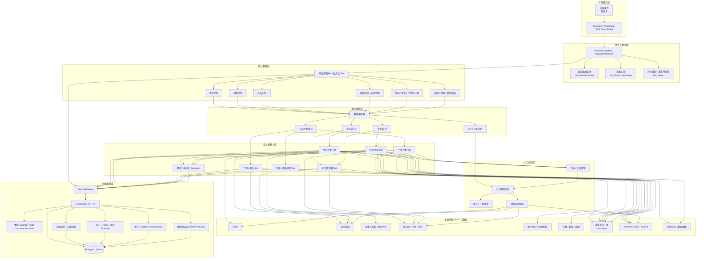

# Memoh 智能客服系统架构方案

> 目标客户：途鸽公司
>
> 目标场景：在现有 Memoh 通用型人工智能助理平台基础上，扩展支持面向外部客户的全球化、多语言智能客服能力。
>
> 目标规模：约 1000 会话/天
>
> 核心原则：不单独新建一套客服平台，而是在现有平台上扩展“客服域能力”，同时兼容企业内部助理场景与外部客户服务场景。

---

## 1. 结论摘要

### 1.1 是否需要新做一个项目？

当前阶段**不建议重新开发一个独立项目**。

原因：

- 现有 Memoh 已具备多 bot、容器隔离、MCP 工具扩展、技能系统、会话历史、消息通道、subagent、多模型路由等核心平台能力。
- 对于 **1000 会话/天** 的智能客服规模，这不是一个以“极限吞吐”为核心矛盾的问题，更多是一个 **业务分流、权限隔离、系统接入、人工协同** 的产品建模问题。
- 当前项目已经有企业能力扩展基础，例如：department、RBAC、audit、budget、model routing、cockpit 等，这些都适合继续承载客服场景。

### 1.2 推荐方向

推荐把智能客服设计为 Memoh 平台中的一个业务域：

- 内部团队使用：企业助理 / 个人助理 / 部门助理
- 外部客户使用：智能客服 Bot 体系
- 二者共用：
  - 统一 bot 平台
  - 统一模型与 MCP 能力层
  - 统一权限、审计、成本与监控体系

换句话说，应该做的是：

> **一个统一 AI 平台，承载内部助手与外部智能客服两类场景。**

---

## 2. 业务目标与设计原则

### 2.1 业务目标

途鸽的客服业务具备以下特点：

- 客户来自全球，语言种类多
- 客服大类分为：售前、售后
- 每个大类下又按产品分组
- 不同产品需要访问不同内部系统
- 当前人工流程是：
  1. 接收客户消息
  2. 判断语言、问题类型、产品归属
  3. 路由到不同专业人员处理

### 2.2 对应的 AI 平台目标

因此，客服系统不应该只是一个“聊天机器人”，而应该具备：

- 多语言识别与处理能力
- 问题分类能力
- 产品识别能力
- 情绪识别与安抚能力
- 路由与分发能力
- 专业 bot 协作能力
- 人工接管能力
- 企业系统工具隔离能力

### 2.3 设计原则

1. **统一平台，不做双系统割裂**
   - 内部助理和外部客服共享同一平台底座。

2. **组织归属与业务路由分离**
   - department 负责归属、权限、模板管理。
   - queue / service unit 负责业务分流。

3. **工具权限按 bot 隔离**
   - 不同产品客服 bot 只能访问对应系统。

4. **优先委派，不优先 bot 互聊**
   - 用前台 bot + subagent / specialist bot 的方式组织协作。

5. **人工客服不是补丁，而是一等角色**
   - 系统必须支持转人工、升级、工单、坐席辅助。

---

## 3. 当前 Memoh 可复用能力

基于当前代码结构，以下能力已经具备或具备明显基础：

### 3.1 bot 运行时隔离

- 每个 bot 运行在独立容器中
- MCP 能力按 bot 维度隔离
- 有利于把内部助理与客服 bot 分开治理

### 3.2 技能系统

- bot 可拥有独立 skills
- 很适合为“售前 bot / 售后 bot / 产品专家 bot”配置不同技能模板

### 3.3 MCP 工具体系

- bot 可接入不同内部系统与工具
- 可按产品线区分 CRM、订单、设备、套餐、计费、知识库等访问能力

### 3.4 department 能力

当前 enterprise 扩展中已有：

- 部门
- 部门成员
- bot 对部门的访问授权
- 部门技能模板
- RBAC 相关能力

这意味着“智能客服部”作为一个组织单元是合理的。

### 3.5 subagent 机制

当前已存在主 bot 调用 subagent 的能力，适合做：

- 语言专家 subagent
- 产品专家 subagent
- 售后诊断 subagent
- 翻译 / 本地化 subagent

### 3.6 消息、历史、inbox

现有系统已有：

- 历史消息持久化
- bot inbox
- channel 消息发送能力

适合承载客服消息流、异步通知、未处理项与后续检索。

---

## 4. 客服版完整系统架构



---

## 5. 如何同时支持内部助理与外部客服

### 5.1 不建议用“是否客服”去硬分系统

不建议把平台拆成：

- 一个内部助理系统
- 一个外部客服系统

这样会造成：

- 能力重复建设
- bot 能力和工具重复配置
- 模型、审计、权限、监控体系分裂
- 后续内部坐席辅助与外部客服协同困难

### 5.2 推荐的分层方式

应该这样区分：

#### 组织层：department

例如：

- 综合行政部
- 市场部
- 智能客服部
- 技术支持部

#### 业务层：queue / service unit

例如客服域内部再分：

- 售前队列
- 售后队列
- 产品 A 队列
- 产品 B 队列
- VIP 队列

#### bot 层：角色 bot

例如：

- 前台路由 bot
- 售前专家 bot
- 售后专家 bot
- 产品专家 bot
- 坐席辅助 bot

#### 能力层：skill + MCP + permission

例如：

- 售前 bot：可访问 FAQ、产品知识库、CRM
- 售后 bot：可访问订单、退款、工单、设备状态
- 产品 A bot：可访问产品 A 专属平台
- 产品 B bot：可访问产品 B 专属平台

### 5.3 推荐的归纳方式

一句话：

> **department 负责组织归属，queue 负责业务路由，bot 负责执行能力，MCP/skill 负责权限边界。**

---

## 6. bot 与 bot 之间如何协作

### 6.1 当前最适合的协作方式：委派

从当前代码实现看，最正式的 bot 协作机制是：

- 主 bot 调用 subagent
- subagent 处理后返回结果
- 主 bot 再决定是否继续处理、继续路由或转人工

也就是说，当前更适合使用：

- **前台 bot → subagent / specialist bot 委派**

而不是：

- bot A 和 bot B 长链条来回互聊

### 6.2 当前可用的协作路径

1. **主 bot → subagent**
   - 用于问题拆解、领域专家协作、翻译、本地化、诊断。

2. **bot → 外部消息通道**
   - 用于给不同目标发送消息、跨群或跨渠道通知。

3. **inbox / history 异步协作**
   - 用于待处理项、异步通知、检索与补处理。

### 6.3 客服场景中的推荐协作模型

推荐这样组织：

- 客户只面对一个“前台客服 bot”
- 前台客服 bot 内部委派给多个 subagent / 专业 bot
- 如果 AI 不能完成，则转人工
- 人工坐席旁边再挂一个 copilot bot

这样能避免 bot 间状态同步过于复杂。

---

## 7. 推荐的客服组织模型

### 7.1 顶层组织

```text
智能客服部
├── 售前服务单元
├── 售后服务单元
├── 产品A服务单元
├── 产品B服务单元
└── VIP与升级处理单元
```

### 7.2 bot 角色设计

#### 角色 1：前台路由 Bot

职责：

- 识别语言
- 判断售前 / 售后
- 判断产品归属
- 判断用户情绪等级
- 判断是否需要先安抚再处理问题
- 判断紧急程度
- 判断是否应转人工
- 路由到专业服务单元

#### 角色 1.1：情绪安抚策略

前台路由 bot 在客服场景中不只是做分类，还应承担第一层情绪治理职责：

- 识别用户是否处于不满、愤怒、焦虑、讽刺、投诉升级等状态
- 判断当前问题是否属于“先安抚情绪，再处理业务”的场景
- 对明显激动的客户优先使用低冲突、共情型、确认型话术
- 如果在有限轮次内无法把情绪从激动状态拉回可沟通状态，则应尽快转人工

建议把“情绪风险”作为路由条件之一，与语言、产品线、问题类型并列处理。

#### 角色 2：专业 Bot

类型示例：

- 售前专家 Bot
- 售后专家 Bot
- 产品专家 Bot
- 订单查询 Bot
- 网络 / 设备诊断 Bot
- 知识库 Bot

#### 角色 3：人工坐席 Copilot

职责：

- 给人工客服提供上下文摘要
- 自动生成回复草稿
- 自动查知识库 / 订单 / 用户资料
- 在接管后继续作为辅助助手存在

---

## 8. 当前架构下的最小改造方案

为了尽快落地客服场景，推荐先做“最小可用扩展”，而不是一次性重构成完整客服平台。

这里建议把实施分成 **试点验证 → 业务成型 → 规模化运营** 三个阶段推进，每个阶段都要有明确的交付物、验收标准和是否进入下一阶段的判断条件。

### 8.1 实施总原则

1. **先配置化，后平台化**
   - 第一阶段优先通过 department、bot metadata、skill、MCP 授权、prompt 编排实现业务闭环。
   - 不急于一开始引入复杂的新表、新状态机和规则引擎。

2. **先跑通单条业务链路，再扩产品线**
   - 优先选一个典型产品、一个典型售前场景、一个典型售后场景做试点。

3. **先保证可控，再追求自动化率**
   - 早期以“路由正确、权限正确、可转人工”为核心，不以 AI 替代率作为第一目标。

4. **人工协同能力必须同步建设**
   - 智能客服不是纯 bot 项目，必须同时设计转人工、会话接管、上下文摘要、处理记录。

---

### 8.2 Phase 1：试点可跑通阶段

**目标：** 跑通从客户消息进入，到 AI 路由，再到专业 bot 响应或转人工的最小闭环。

**建议范围：**

- 先接入 1 个外部渠道，例如 Web Chat 或 Telegram
- 先覆盖 1 个主要产品线
- 先覆盖 2 类高频问题：
  - 售前咨询
  - 售后查询 / 基础问题

**本阶段建议建设内容：**

1. 建立“智能客服部”
2. 建立几类客服 bot：
   - 前台路由 bot
   - 售前 bot
   - 售后 bot
   - 产品专家 bot
3. 为不同 bot 配置不同 skill 模板
4. 为不同 bot 配置不同 MCP 权限
5. 在 bot metadata 中增加业务域标记，例如：
   - `domain = customer_service`
   - `service_type = presales | aftersales`
   - `product_line = xxx`
6. 用当前 subagent 能力实现内部委派
7. 先通过配置和 prompt 路由，避免过早引入复杂规则引擎
8. 定义最基本的人工接管规则：
   - 哪些问题必须转人工
   - 哪些高情绪风险客户必须优先转人工
   - 转人工前允许 bot 最多做几轮安抚尝试
   - 如果情绪持续升级或出现辱骂、投诉升级、威胁扩散等信号，立即转人工
   - 转人工后客户收到什么反馈
   - 人工如何看到最近上下文
   - 人工如何看到情绪判断结果与安抚尝试记录
9. 为前台路由 bot 增加情绪识别与安抚策略：
   - 识别激动、不满、焦虑、投诉升级等情绪状态
   - 根据情绪等级选择更稳妥的话术模板
   - 记录情绪是否由激动转为平复，作为后续优化依据

**本阶段交付物：**

- 客服域 bot 清单
- 客服域 skill 模板清单
- 客服域 MCP 权限矩阵
- 前台路由 bot prompt / routing 策略
- 情绪识别与安抚话术策略
- 高情绪风险转人工规则
- 优秀安抚话术案例沉淀机制
- 试点产品知识库与 FAQ
- 人工接管操作说明
- 基础监控面板：会话量、转人工率、失败率、情绪升级率

**验收标准：**

- 客户消息可从外部渠道进入 Memoh
- 系统可识别主要语言并输出对应语言回复
- 系统可在售前 / 售后 / 产品线之间完成基本分流
- 系统可识别高情绪风险客户，并执行安抚或转人工策略
- 专业 bot 只能访问本产品允许的工具
- 无法处理的问题可以明确转人工
- 高情绪客户在安抚失败后可被及时转人工
- 关键过程可审计、可回溯

**建议阶段产出形式：**

- 先用配置和文档把组织关系跑起来
- 不强依赖新增 schema
- 先验证业务模型是否成立

---

### 8.3 Phase 2：业务成型阶段

**目标：** 把试点能力沉淀成客服域的一等能力，而不是继续长期依赖 prompt 和人工约定。

**本阶段建议建设内容：**

- 服务队列模型
- 路由规则模型
- 情绪状态与安抚效果评估模型
- 转人工状态机
- 工单模型
- 会话优先级与 SLA
- 升级处理机制
- 客服质检报表
- 坐席工作台 / Copilot 辅助能力

**建议新增平台能力：**

1. **服务队列**
   - 把“售前队列 / 售后队列 / 产品队列 / VIP 队列”从约定变成正式模型。

2. **显式路由规则**
   - 将语言、产品、问题类型、紧急程度、客户等级等条件固化为可管理规则。

3. **人工接管闭环**
   - 支持会话状态变化：AI处理中、待人工接管、人工处理中、已解决、待回访。

4. **工单化管理**
   - 对需要跨班次、跨团队处理的问题建立 ticket 与事件记录。

5. **安抚效果沉淀与复用**
   - 把成功把客户情绪从激动转为平复甚至正向反馈的对话样本沉淀为可复用话术资产，用于后续 prompt、知识库、质检和培训优化。

6. **坐席辅助 Copilot**
   - 为人工客服提供摘要、建议回复、知识库检索、系统信息聚合。

**本阶段交付物：**

- `service_queues` 等客服域核心模型
- 情绪分级 / 安抚效果评估能力
- 路由规则管理能力
- 转人工 / 升级 / 接管状态流
- 工单中心或工单接口对接
- 客服运营报表初版
- 坐席辅助 bot 或坐席辅助面板

**验收标准：**

- 新产品线接入时不需要重写整套 prompt
- 路由决策可配置、可解释、可审计
- 情绪识别结果、安抚尝试过程、转人工决策可被追踪
- 人工接管全链路有状态、有记录
- 跨团队协作问题可通过 ticket 持续跟踪
- 坐席能在接手时直接看到 AI 总结和上下文
- 成功安抚高情绪客户的话术可被沉淀和复用
---

### 8.4 Phase 3：规模化运营阶段

**目标：** 面向多地区、多产品、多语言和更高运营要求进行优化，把系统从“能用”提升到“可持续运营”。

**本阶段建议建设内容：**

- 更完整的多语言知识库体系
- 区域化模型策略
- 情绪识别精细化与安抚策略优化
- 自动回访 / 定时跟进
- 复杂运营报表
- 客服 KPI 与 AI 辅助效果量化
- 高价值客户 / 高风险会话识别
- 更细粒度的权限与合规控制

**重点优化方向：**

1. **多语言运营体系**
   - 不只是翻译回复，还包括多语言知识库、术语统一、本地化 SOP。

2. **区域化模型与策略**
   - 针对不同地区、不同语言、不同成本约束选择不同模型和路由策略。

3. **主动服务能力**
   - 支持自动提醒、回访、订单跟踪、售后追踪、超时催办。

4. **客服运营分析**
   - 分析首次响应率、问题解决率、转人工率、重复咨询率、客户满意度、情绪缓和率。

5. **情绪策略持续优化**
   - 识别哪些安抚话术更容易把高情绪客户从激动状态带回平复状态，并将其沉淀为多语言策略模板。

6. **质量与合规治理**
   - 建立质检抽查、敏感操作审计、跨产品数据访问审计。

**本阶段交付物：**

- 多语言知识库治理机制
- 分区域模型路由策略
- 自动回访 / 自动跟进能力
- 运营报表与 KPI 看板
- 质检与合规审计流程

**验收标准：**

- 新语言、新地区接入成本显著降低
- 高价值场景有清晰 SLA 与升级机制
- 运营团队可以持续衡量 AI 客服效果
- 合规和权限问题可被快速发现和追踪

---

### 8.5 建议实施顺序

推荐按以下顺序推进：

1. **组织建模**
   - 先确定客服部门、服务单元、bot 角色边界。

2. **权限建模**
   - 梳理不同 bot 可访问哪些内部系统、哪些数据字段、哪些动作。

3. **试点产品接入**
   - 选一条产品线，完成知识库、FAQ、系统工具接入。

4. **路由 bot 上线**
   - 先让路由 bot 负责识别语言、分类问题、选择专业 bot。

5. **专业 bot 上线**
   - 逐个接入售前、售后、产品专家 bot。

6. **人工接管上线**
   - 让客服主管和人工坐席能真正接手会话。

7. **数据化运营**
   - 观察路由准确率、转人工率、处理时长、失败原因，再决定是否进入下一阶段。

---

### 8.6 项目角色建议

为了让实施更顺利，建议至少明确以下角色：

- **业务负责人**：定义售前 / 售后流程、升级规则、服务边界
- **知识库负责人**：维护 FAQ、SOP、产品资料、多语言内容
- **系统集成人员**：梳理 CRM、订单、设备、计费等系统接入
- **平台研发人员**：负责 bot、MCP、权限、路由、工单等实现
- **运营 / 质检人员**：验证回答质量、标注问题案例、持续优化规则

---

### 8.7 推荐里程碑

#### Milestone A：完成试点上线

代表系统已经具备最小客服能力。

#### Milestone B：完成人工接管闭环

代表系统已经不是单纯的机器人答复，而是具备真实客服处理能力。

#### Milestone C：完成客服域平台化

代表服务队列、规则、工单、报表都已经成为标准能力。

#### Milestone D：完成多区域规模化运营

代表系统可以持续复制到更多产品线、更多语言和更多区域。

---

## 9. 建议新增的数据模型

当前建议不要一开始就把 bot type 扩成新的枚举，而是先在 metadata 中表达业务域。

### 9.1 bot metadata 建议字段

```json
{
  "domain": "customer_service",
  "service_type": "presales",
  "product_line": "global_wifi",
  "service_queue": "presales-global-wifi",
  "region_scope": ["global"],
  "languages": ["zh", "en", "ja", "es"],
  "human_handoff_enabled": true,
  "emotion_policy": {
    "enabled": true,
    "max_deescalation_turns": 2,
    "handoff_on_high_risk": true
  }
}
```

### 9.2 建议新增的核心实体

后续如果进入第二阶段，可新增：

- `service_queues`
- `queue_members`
- `queue_bot_bindings`
- `conversation_handoffs`
- `tickets`
- `ticket_events`
- `routing_rules`
- `customer_profiles`
- `conversation_labels`
- `conversation_emotion_states`
- `deescalation_attempts`
- `deescalation_playbooks`

### 9.3 为什么先用 metadata

因为当前平台已经有：

- bots
- departments
- settings
- RBAC
- MCP capability

先用 metadata 可以：

- 降低 schema 变更范围
- 快速验证组织模型是否合理
- 避免过早把客服域写死进通用平台核心数据结构

---

## 10. 接口与数据模型映射

这一节的目标不是重新设计一套脱离现状的客服接口，而是把“当前 Memoh 已有接口 / 服务 / 数据表”与“客服域目标能力”对齐，明确：

- 哪些能力现在就能承载
- 哪些能力适合先通过 metadata / prompt / 配置实现
- 哪些能力应在第二阶段沉淀为正式模型

### 10.1 当前接口能力映射

#### A. 会话接入与执行接口

当前 agent gateway 已经提供以下执行入口：

- `/chat`
- `/chat/stream`
- `/chat/trigger-schedule`
- `/chat/trigger-heartbeat`
- `/chat/subagent`

这意味着客服域最小闭环里，以下动作不需要先新增一套独立执行接口：

- 客户消息进入后触发 bot 对话
- 流式回复给前端或渠道适配层
- 定时回访 / 跟进任务触发
- heartbeat 类巡检或主动触达任务触发
- 前台 bot 委派 subagent / specialist bot

对应关系如下：

| 客服能力 | 当前接口/能力 | 说明 |
| --- | --- | --- |
| 客户发起咨询 | `/chat` / `/chat/stream` | 可直接作为 Web Chat、外部渠道适配后的统一会话执行入口 |
| AI 流式回复 | `/chat/stream` | 适合客服前台会话、坐席工作台、Web Chat |
| 专家 bot 委派 | `/chat/subagent` | 可承载语言识别、产品识别、售后诊断、翻译等内部委派 |
| 定时跟进 / 回访 | `/chat/trigger-schedule` | 可支撑售后回访、超时提醒、订单跟踪 |
| 主动巡检 / 日报类任务 | `/chat/trigger-heartbeat` | 可承载运营类、巡检类、提醒类任务 |

#### B. 路由与策略挂载点

当前服务端已经有两个关键扩展挂载点：

1. **Chat Pre Check**
   - 可在消息真正进入对话前做前置判断。
   - 当前已用于预算检查。
   - 在客服域中，也可扩展承载：
     - 黑名单 / 风险会话拦截
     - 特定产品线的前置路由限制
     - 必须转人工的场景预判

2. **Model Override**
   - 可在实际执行前根据请求复杂度覆盖模型。
   - 当前已用于 enterprise model routing。
   - 在客服域中，可进一步用于：
     - 不同语言使用不同模型
     - VIP / 高复杂度问题提升模型档位
     - 高成本模型只给少数高价值场景使用

#### C. 企业管理接口

当前 enterprise 模块已经正式接入以下能力：

- Department
- Audit
- Cockpit
- Hands
- Model Routing
- Cost Tracking

这些接口对客服域的价值分别是：

| 企业能力 | 客服域作用 |
| --- | --- |
| Department | 承载“智能客服部”、售前组、售后组、产品服务组等组织归属 |
| Audit | 记录权限变更、路由策略调整、关键客服操作 |
| Cockpit | 形成会话量、处理效率、转人工率等运营视角的报表基础 |
| Hands | 适合承载批量跟进、定时触发、运营动作脚本 |
| Model Routing | 按复杂度 / 成本 / 场景做模型路由 |
| Cost Tracking / Budget | 控制客服场景预算，避免多语言与高峰期成本失控 |

#### D. 第一阶段建议补充的请求字段

这里的目标不是立刻推翻当前接口，而是给现有 `/chat`、`/chat/stream`、`/chat/subagent`、调度触发接口补充一组适合客服域的上下文字段。第一阶段建议优先放在 `metadata`、`context`、渠道适配层入参中，避免过早做破坏性接口升级。

**建议字段：会话入口请求侧**

| 字段 | 说明 | 用途 |
| --- | --- | --- |
| `channel_type` | 渠道类型，如 web / telegram / whatsapp / email | 识别外部来源与回复方式 |
| `external_conversation_id` | 外部会话 ID | 绑定渠道侧会话 |
| `external_thread_id` | 外部线程 ID，可选 | 支持群聊/邮件线程/子线程 |
| `customer_id` | 客户标识，可来自 CRM 或外部系统 | 关联客户画像与历史 |
| `customer_tier` | 客户等级，如 normal / vip | 支持 SLA 与模型、人工优先级策略 |
| `service_domain` | 业务域标识，固定为 `customer_service` | 区分内部助理与外部客服流量 |
| `service_type_hint` | 售前/售后提示，可为空 | 给前台路由 bot 一个弱提示 |
| `product_line_hint` | 产品线提示，可为空 | 当渠道已知产品归属时减少错分 |
| `language_hint` | 渠道或前端已知语言 | 减少重复识别成本 |
| `route_hint` | 指定队列或 bot 的弱提示 | 支持人工指定或渠道映射规则 |
| `customer_message_id` | 客户消息唯一标识 | 去重、审计、重放保护 |
| `received_at` | 渠道收到消息的时间 | 统计首响时延与 SLA |

**建议字段：客服上下文扩展**

| 字段 | 说明 | 用途 |
| --- | --- | --- |
| `emotion_snapshot.level` | low / medium / high | 记录入口时情绪等级 |
| `emotion_snapshot.tags` | anger / anxiety / complaint 等 | 支持安抚和转人工策略 |
| `emotion_snapshot.source` | 渠道预判 / 模型预判 / 人工标记 | 说明情绪来源 |
| `handoff_context.required` | 是否必须转人工 | 支持强规则场景 |
| `handoff_context.reason` | 转人工原因 | 支持追踪与审计 |
| `policy_flags` | 黑名单、敏感场景、合规限制等 | 供 Chat Pre Check 使用 |
| `trace_id` | 全链路追踪 ID | 关联路由、subagent、审计、cockpit |
| `session_labels` | 临时标签列表 | 支持阶段一的 metadata 式运营标记 |

#### E. 第一阶段建议补充的输出字段

为了让路由、人工接管、运营报表能串起来，建议在当前响应、流式事件、历史 metadata 中统一沉淀以下输出字段。

| 字段 | 说明 | 用途 |
| --- | --- | --- |
| `detected_language` | 模型最终识别语言 | 审计识别准确率 |
| `resolved_service_type` | 最终判断的售前/售后类型 | 复盘路由准确率 |
| `resolved_product_line` | 最终判断产品线 | 复盘产品归属准确率 |
| `resolved_queue` | 最终进入的服务队列 | 支撑后续队列模型演进 |
| `emotion_assessment.level` | 当前轮次情绪等级 | 支撑情绪趋势分析 |
| `emotion_assessment.tags` | 当前轮次情绪标签 | 支撑质检与运营分析 |
| `deescalation_result` | calmed / unchanged / escalated | 评估安抚效果 |
| `handoff_decision` | none / suggested / required / completed | 串联 AI 与人工处理流 |
| `handoff_reason` | emotion_risk / unresolved / policy_required 等 | 支撑转人工规则复盘 |
| `reply_style` | apology / calming / informative / action_oriented | 记录本轮话术策略 |
| `used_subagents` | 本轮调用的专家列表 | 解释 bot 内部协作过程 |
| `cost_tier` | 本轮使用的模型档位 | 做成本与效果对比 |

#### F. `/chat/subagent` 与调度接口建议字段

客服域里 subagent 与 follow-up 触发会比普通助手场景更重要，建议对这两类入口补充更明确的任务上下文。

**`/chat/subagent` 建议字段**

| 字段 | 说明 | 用途 |
| --- | --- | --- |
| `task_type` | translate / classify / diagnose / summarize | 限定 subagent 职责 |
| `parent_trace_id` | 父请求追踪 ID | 串联主 bot 与 subagent |
| `target_capability` | 目标能力标签 | 约束委派边界 |
| `customer_context` | 客户等级、产品、区域等摘要 | 减少重复传全量历史 |
| `emotion_context` | 当前情绪等级与风险 | 让 subagent 输出更贴合客服语气 |
| `return_schema` | 期望返回结构 | 降低自由文本导致的编排成本 |

**`/chat/trigger-schedule` / `/chat/trigger-heartbeat` 建议字段**

| 字段 | 说明 | 用途 |
| --- | --- | --- |
| `trigger_type` | follow_up / timeout_check / revisit / report | 区分运营任务类型 |
| `related_conversation_id` | 关联的客服会话 ID | 让回访与原会话对齐 |
| `follow_up_reason` | 售后回访 / 超时催办 / 客诉回看 | 支撑运营动作审计 |
| `expected_action` | remind / summarize / escalate | 明确任务目标 |
| `operator_id` | 发起人或系统任务标识 | 审计来源 |

#### G. 兼容现状的接口示例

下面的示例刻意遵守当前 gateway 已存在的 body 结构，不假设第一阶段立刻新增顶层字段。也就是说，客服域扩展字段先通过 `messages[].metadata`、渠道适配层上下文、历史 metadata 注入；等第二阶段再考虑把高频字段升级为显式 schema。

**示例 1：外部客户进入 `/chat`**

```json
{
  "model": {
    "modelId": "claude-sonnet-4-6",
    "clientType": "anthropic-messages",
    "input": ["text"],
    "apiKey": "${MODEL_API_KEY}",
    "baseUrl": "https://api.anthropic.com",
    "reasoning": {
      "enabled": true,
      "effort": "medium"
    },
    "store": false
  },
  "activeContextTime": 86400,
  "channels": ["web", "schedule", "heartbeat"],
  "currentChannel": "web",
  "messages": [
    {
      "role": "system",
      "content": "You are the front-desk customer service router bot.",
      "metadata": {
        "customer_service": {
          "service_domain": "customer_service",
          "channel_type": "web",
          "external_conversation_id": "webconv_20260321_0001",
          "customer_id": "cust_tuge_001",
          "customer_tier": "vip",
          "language_hint": "en",
          "product_line_hint": "global_wifi",
          "trace_id": "trace_cs_20260321_0001",
          "session_labels": ["new_customer", "vip"]
        }
      }
    },
    {
      "role": "user",
      "content": "My device cannot connect after I landed in Tokyo.",
      "metadata": {
        "customer_service": {
          "customer_message_id": "msg_ext_8848",
          "received_at": "2026-03-21T10:00:12Z",
          "emotion_snapshot": {
            "level": "medium",
            "tags": ["anxiety"],
            "source": "channel_precheck"
          },
          "handoff_context": {
            "required": false,
            "reason": ""
          },
          "policy_flags": ["cross_border_support"]
        }
      }
    }
  ],
  "usableSkills": [],
  "skills": ["customer-service-router", "handoff-policy"],
  "identity": {
    "botId": "bot_frontdesk_cs",
    "containerId": "ctr_frontdesk_cs",
    "channelIdentityId": "channel_web_widget",
    "displayName": "途鸽智能客服",
    "currentPlatform": "web",
    "replyTarget": "web-session:webconv_20260321_0001",
    "conversationType": "dm"
  },
  "attachments": [],
  "mcpConnections": [],
  "inbox": [],
  "loopDetection": {
    "enabled": true
  },
  "query": "My device cannot connect after I landed in Tokyo."
}
```

**示例 2：`/chat` 的客服响应扩展示例**

下面不是要求第一阶段马上改成这个固定返回结构，而是建议把这些字段沉淀到响应扩展、流式事件或 `bot_history_messages.metadata` 中，保证后续能做路由复盘、情绪复盘和转人工审计。

```json
{
  "reply": "I’m sorry you’re having trouble right after landing. Let me check your device and network status first.",
  "metadata": {
    "customer_service": {
      "trace_id": "trace_cs_20260321_0001",
      "detected_language": "en",
      "resolved_service_type": "aftersales",
      "resolved_product_line": "global_wifi",
      "resolved_queue": "aftersales-global-wifi",
      "emotion_assessment": {
        "level": "medium",
        "tags": ["anxiety"]
      },
      "deescalation_result": "unchanged",
      "handoff_decision": "none",
      "handoff_reason": "",
      "reply_style": "calming",
      "used_subagents": [
        {
          "name": "network-diagnosis",
          "task_type": "diagnose"
        }
      ],
      "cost_tier": "standard"
    }
  }
}
```

**示例 3：前台 bot 调用 `/chat/subagent` 做产品与问题分类**

现阶段 `task_type`、`parent_trace_id`、`emotion_context` 等字段可以先通过 `messages[].metadata.subagent_context` 传入，而不必先改动 `/chat/subagent` 的顶层 schema。

```json
{
  "model": {
    "modelId": "claude-sonnet-4-6",
    "clientType": "anthropic-messages",
    "input": ["text"],
    "apiKey": "${MODEL_API_KEY}",
    "baseUrl": "https://api.anthropic.com",
    "reasoning": {
      "enabled": true,
      "effort": "medium"
    },
    "store": false
  },
  "identity": {
    "botId": "bot_frontdesk_cs",
    "containerId": "ctr_frontdesk_cs",
    "channelIdentityId": "channel_web_widget",
    "displayName": "途鸽智能客服",
    "currentPlatform": "web",
    "replyTarget": "web-session:webconv_20260321_0001",
    "conversationType": "dm"
  },
  "messages": [
    {
      "role": "system",
      "content": "Classify the issue and return structured routing advice.",
      "metadata": {
        "subagent_context": {
          "task_type": "classify",
          "parent_trace_id": "trace_cs_20260321_0001",
          "target_capability": "routing.product_and_issue_classification",
          "customer_context": {
            "customer_tier": "vip",
            "region": "jp",
            "product_line_hint": "global_wifi"
          },
          "emotion_context": {
            "level": "medium",
            "tags": ["anxiety"]
          },
          "return_schema": {
            "service_type": "string",
            "product_line": "string",
            "queue": "string",
            "confidence": "number"
          }
        }
      }
    }
  ],
  "query": "User cannot connect in Tokyo after activating global Wi-Fi service.",
  "name": "routing-classifier",
  "description": "Classify service type, product line, and target queue for customer service routing.",
  "loopDetection": {
    "enabled": true
  }
}
```

**示例 4：`/chat/trigger-schedule` 发起售后回访**

当前 `schedule` 自身字段保持不变，客服域 follow-up 语义先通过 `messages[].metadata.trigger_context` 表达。

```json
{
  "model": {
    "modelId": "claude-sonnet-4-6",
    "clientType": "anthropic-messages",
    "input": ["text"],
    "apiKey": "${MODEL_API_KEY}",
    "baseUrl": "https://api.anthropic.com",
    "reasoning": {
      "enabled": false,
      "effort": "low"
    },
    "store": false
  },
  "activeContextTime": 86400,
  "channels": ["schedule"],
  "currentChannel": "schedule",
  "messages": [
    {
      "role": "system",
      "content": "Run a customer-service follow-up task.",
      "metadata": {
        "trigger_context": {
          "trigger_type": "follow_up",
          "related_conversation_id": "conv_cs_20260320_1024",
          "follow_up_reason": "aftersales_checkin",
          "expected_action": "summarize",
          "operator_id": "system:auto_followup",
          "trace_id": "trace_cs_followup_20260321_0007"
        }
      }
    }
  ],
  "usableSkills": [],
  "skills": ["aftersales-followup"],
  "identity": {
    "botId": "bot_aftersales_cs",
    "containerId": "ctr_aftersales_cs",
    "channelIdentityId": "channel_scheduler",
    "displayName": "途鸽售后回访助手",
    "currentPlatform": "schedule",
    "conversationType": "job"
  },
  "attachments": [],
  "mcpConnections": [],
  "inbox": [],
  "loopDetection": {
    "enabled": true
  },
  "schedule": {
    "id": "sch_followup_001",
    "name": "Aftersales Follow-up",
    "description": "24h follow-up for unresolved cross-border connectivity issue",
    "pattern": "0 10 * * *",
    "maxCalls": 1,
    "command": "follow up unresolved aftersales conversation"
  }
}
```

**示例 5：`/chat/trigger-heartbeat` 做超时巡检与升级判断**

```json
{
  "model": {
    "modelId": "claude-sonnet-4-6",
    "clientType": "anthropic-messages",
    "input": ["text"],
    "apiKey": "${MODEL_API_KEY}",
    "baseUrl": "https://api.anthropic.com",
    "reasoning": {
      "enabled": false,
      "effort": "low"
    },
    "store": false
  },
  "activeContextTime": 86400,
  "channels": ["heartbeat"],
  "currentChannel": "heartbeat",
  "messages": [
    {
      "role": "system",
      "content": "Check whether any VIP customer conversation needs escalation.",
      "metadata": {
        "trigger_context": {
          "trigger_type": "timeout_check",
          "related_conversation_id": "conv_cs_20260321_0201",
          "follow_up_reason": "sla_timeout_risk",
          "expected_action": "escalate",
          "operator_id": "system:heartbeat",
          "trace_id": "trace_cs_hb_20260321_0011"
        }
      }
    }
  ],
  "usableSkills": [],
  "skills": ["sla-guard", "handoff-policy"],
  "identity": {
    "botId": "bot_frontdesk_cs",
    "containerId": "ctr_frontdesk_cs",
    "channelIdentityId": "channel_heartbeat",
    "displayName": "途鸽智能客服",
    "currentPlatform": "heartbeat",
    "conversationType": "job"
  },
  "attachments": [],
  "mcpConnections": [],
  "inbox": [],
  "loopDetection": {
    "enabled": true
  },
  "heartbeat": {
    "interval": 30
  }
}
```

**示例 6：`/chat/stream` 的 SSE 事件序列（成功完成）**

当前 `/chat/stream` 本质上是把每个 `AgentStreamAction` JSON 序列化后包装成 SSE `data:` 行输出。下面的示例省略请求体中的大块模型配置，只保留客服场景最关键的字段。

```text
data:{"type":"agent_start","input":{"query":"My device cannot connect after I landed in Tokyo.","skills":["customer-service-router","handoff-policy"]}}

data:{"type":"reasoning_start","metadata":{"type":"reasoning-start"}}

data:{"type":"reasoning_delta","delta":"用户使用英语，问题属于售后，疑似全球 Wi-Fi 连接失败，需要先确认产品线与服务队列。"}

data:{"type":"reasoning_end","metadata":{"type":"reasoning-end"}}

data:{"type":"tool_call_start","toolName":"use_skill","toolCallId":"call_router_001","input":{"skill":"customer-service-router"},"metadata":{"toolName":"use_skill"}}

data:{"type":"tool_call_end","toolName":"use_skill","toolCallId":"call_router_001","input":{"skill":"customer-service-router"},"result":{"skillName":"customer-service-router","output":{"resolved_service_type":"aftersales","resolved_product_line":"global_wifi","resolved_queue":"aftersales-global-wifi","emotion_assessment":{"level":"medium","tags":["anxiety"]},"deescalation_result":"unchanged"}},"metadata":{"toolName":"use_skill"}}

data:{"type":"text_start"}

data:{"type":"text_delta","delta":"I’m sorry you’re having trouble right after landing. "}

data:{"type":"text_delta","delta":"I can help you troubleshoot your global Wi-Fi connection first. "}

data:{"type":"text_end","metadata":{"type":"text-end"}}

data:{"type":"agent_end","messages":[{"role":"assistant","content":"I’m sorry you’re having trouble right after landing. I can help you troubleshoot your global Wi-Fi connection first.","metadata":{"customer_service":{"trace_id":"trace_cs_20260321_0001","detected_language":"en","resolved_service_type":"aftersales","resolved_product_line":"global_wifi","resolved_queue":"aftersales-global-wifi","emotion_assessment":{"level":"medium","tags":["anxiety"]},"handoff_decision":"none","reply_style":"calming","used_skills":["customer-service-router","handoff-policy"]}}}],"reasoning":["用户使用英语，问题属于售后，疑似全球 Wi-Fi 连接失败，需要先确认产品线与服务队列。"],"skills":["customer-service-router","handoff-policy"],"usage":{"inputTokens":1250,"outputTokens":180,"totalTokens":1430},"usages":[null]}
```

这个序列里最适合承载客服结构化信息的位置有三个：

1. `tool_call_end.result`：承载路由、情绪评估、策略判断等中间结构化结果。
2. `agent_end.messages[].metadata.customer_service`：承载最终落库、审计、复盘需要的稳定结果。
3. `bot_history_messages.metadata`：承载会话结束后需要长期保存的客服语义。

**示例 7：高风险情绪触发转人工的流式片段**

这个示例说明：第一阶段即便不改 `/chat/stream` 顶层协议，也可以通过技能结果和最终消息 metadata 表达“安抚失败 → 转人工”。

```text
data:{"type":"agent_start","input":{"query":"This is ridiculous, nobody helped me for six hours!","skills":["handoff-policy"]}}

data:{"type":"reasoning_start","metadata":{"type":"reasoning-start"}}

data:{"type":"reasoning_delta","delta":"客户愤怒且存在升级风险，应先安抚，再立即判断是否转人工。"}

data:{"type":"tool_call_start","toolName":"use_skill","toolCallId":"call_handoff_001","input":{"skill":"handoff-policy"},"metadata":{"toolName":"use_skill"}}

data:{"type":"tool_call_end","toolName":"use_skill","toolCallId":"call_handoff_001","input":{"skill":"handoff-policy"},"result":{"skillName":"handoff-policy","output":{"handoff_decision":"transfer_to_human","handoff_reason":"high_emotion_risk","target_queue":"vip-escalation","priority":"p1"}},"metadata":{"toolName":"use_skill"}}

data:{"type":"text_start"}

data:{"type":"text_delta","delta":"I’m sorry this has taken so long. "}

data:{"type":"text_delta","delta":"I’m escalating your case to a human specialist right now. "}

data:{"type":"text_end","metadata":{"type":"text-end"}}

data:{"type":"agent_end","messages":[{"role":"assistant","content":"I’m sorry this has taken so long. I’m escalating your case to a human specialist right now.","metadata":{"customer_service":{"trace_id":"trace_cs_20260321_0099","emotion_assessment":{"level":"high","tags":["anger","complaint"]},"deescalation_result":"handoff_required","handoff_decision":"transfer_to_human","handoff_reason":"high_emotion_risk","resolved_queue":"vip-escalation","sla_policy":"vip_5min"}}}],"reasoning":["客户愤怒且存在升级风险，应先安抚，再立即判断是否转人工。"],"skills":["handoff-policy"],"usage":{"inputTokens":980,"outputTokens":96,"totalTokens":1076},"usages":[null]}
```

**流式事件落地建议**

- `text_delta` 只负责逐字输出客服回复，不建议塞入大块结构化业务字段。
- 路由判断、情绪评估、转人工决策，更适合放在 `tool_call_end.result` 或 `agent_end.messages[].metadata`。
- `attachment_delta` 可用于后续发送截图、卡片、诊断图。
- `reaction_delta` 可用于内部质检、运营标注、优秀话术打标，但不建议直接暴露给外部客户端。
- `agent_abort` 表示请求被取消、上游中断、或 loop guard 主动终止；客服前端需要把它当作异常收尾而不是成功结束。
- `reasoning_*` 是否下发到前端，建议按产品策略控制；如果担心暴露内部判断过程，可以在 gateway 或 BFF 层过滤，仅保留 `text_*`、`tool_call_*`、`agent_end`。

**前端状态机设计（客服会话页 / Web Chat Widget）**

前端不建议把 `/chat/stream` 简单当作“不断追加字符串”的黑盒，而应该显式维护一个会话状态机。这样才能正确处理：

- 正常回复完成
- 用户取消
- 异常中止
- 转人工
- 重试
- 高风险会话升级

#### 状态定义

| 状态 | 含义 | 是否可输入下一条消息 | 是否显示 typing / loading | 典型来源 |
| --- | --- | --- | --- | --- |
| `idle` | 空闲，上一轮已结束 | 是 | 否 | 初始态 / 一轮结束后 |
| `submitting` | 已提交请求，等待首个流式事件 | 否 | 是 | 调用 `/chat/stream` 后 |
| `streaming_text` | 正在接收 `text_delta` | 否 | 是 | 收到 `text_start` / `text_delta` |
| `streaming_tool` | 正在执行技能或工具 | 否 | 是 | 收到 `tool_call_start` 且尚未结束 |
| `awaiting_handoff` | 已决定转人工，等待接管确认 | 视产品策略 | 是/否均可 | `agent_end.metadata.customer_service.handoff_decision != none` |
| `completed` | 本轮正常完成 | 是 | 否 | 收到 `agent_end` |
| `aborted` | 本轮被中止，但已有部分输出 | 是 | 否 | 收到 `agent_abort` |
| `failed` | 本轮协议级失败 | 是 | 否 | 收到 `error` 或连接异常 |
| `reauth_required` | 接入层鉴权失效 | 否 | 否 | `Missing bearer token` / 401 类错误 |
| `handoff_active` | 已切到人工处理态 | 视业务策略，通常否 | 否 | 人工接管确认后 |

#### 核心事件定义

| 事件 | 来源 | 说明 |
| --- | --- | --- |
| `SEND_MESSAGE` | 前端用户动作 | 用户点击发送 |
| `STREAM_OPENED` | 网络层 | SSE / WS 连接建立 |
| `AGENT_START` | 流事件 | 收到 `agent_start` |
| `TEXT_STARTED` | 流事件 | 收到 `text_start` |
| `TEXT_DELTA` | 流事件 | 收到 `text_delta` |
| `TOOL_STARTED` | 流事件 | 收到 `tool_call_start` |
| `TOOL_FINISHED` | 流事件 | 收到 `tool_call_end` |
| `AGENT_END` | 流事件 | 收到 `agent_end` |
| `AGENT_ABORT` | 流事件 | 收到 `agent_abort` |
| `STREAM_ERROR` | 流事件 / 网络层 | 收到 `error` 或连接异常 |
| `USER_CANCEL` | 前端用户动作 | 用户主动取消 |
| `HANDOFF_CONFIRMED` | 后端 / 人工系统 | 人工接管成功 |
| `RETRY` | 前端用户动作 | 用户点击重试 |

#### 主状态流转

```text
idle
  -> SEND_MESSAGE -> submitting

submitting
  -> AGENT_START -> submitting
  -> TEXT_STARTED -> streaming_text
  -> TOOL_STARTED -> streaming_tool
  -> AGENT_END -> completed
  -> AGENT_ABORT -> aborted
  -> STREAM_ERROR -> failed
  -> USER_CANCEL -> aborted

streaming_text
  -> TEXT_DELTA -> streaming_text
  -> TOOL_STARTED -> streaming_tool
  -> AGENT_END -> completed
  -> AGENT_ABORT -> aborted
  -> STREAM_ERROR -> failed
  -> USER_CANCEL -> aborted

streaming_tool
  -> TOOL_FINISHED -> streaming_text 或 streaming_tool
  -> AGENT_END -> completed
  -> AGENT_ABORT -> aborted
  -> STREAM_ERROR -> failed
  -> USER_CANCEL -> aborted

completed
  -> SEND_MESSAGE -> submitting
  -> 若 handoff_decision=transfer_to_human -> awaiting_handoff

awaiting_handoff
  -> HANDOFF_CONFIRMED -> handoff_active
  -> RETRY -> submitting
  -> STREAM_ERROR -> failed

aborted
  -> RETRY -> submitting
  -> SEND_MESSAGE -> submitting

failed
  -> RETRY -> submitting
  -> SEND_MESSAGE -> submitting
  -> 若为鉴权失败 -> reauth_required

reauth_required
  -> 鉴权恢复 -> idle

handoff_active
  -> 人工结束并允许 AI 恢复 -> idle 或 completed
```

#### 前端消息视图建议

前端最好把“会话状态”和“消息状态”分开维护。

**1. 会话级状态**

用于控制：

- 输入框是否可用
- 是否显示“正在思考 / 正在处理”
- 是否显示“正在转人工”
- 是否允许重试

建议结构：

```ts
interface ConversationRuntimeState {
  phase:
    | 'idle'
    | 'submitting'
    | 'streaming_text'
    | 'streaming_tool'
    | 'awaiting_handoff'
    | 'completed'
    | 'aborted'
    | 'failed'
    | 'reauth_required'
    | 'handoff_active'
  currentRequestId?: string
  currentTraceId?: string
  activeToolCallIds: string[]
  handoffDecision?: 'none' | 'transfer_to_human' | 'manual_review'
  errorMessage?: string
}
```

**2. 消息级状态**

用于控制某一条 assistant 消息是不是：

- 正在生成
- 已生成完成
- 被中断
- 因失败未完成
- 已转人工接管

建议结构：

```ts
interface ChatMessageViewModel {
  id: string
  role: 'user' | 'assistant' | 'system'
  text: string
  status: 'streaming' | 'completed' | 'aborted' | 'failed' | 'handoff'
  traceId?: string
  metadata?: Record<string, unknown>
}
```

#### 事件到 UI 行为的映射建议

| 事件 | 前端行为 |
| --- | --- |
| `agent_start` | 创建本轮 assistant 占位消息，状态为 `streaming` |
| `text_start` | 显示 typing/loading 文案 |
| `text_delta` | 追加可见文本到当前 assistant 消息 |
| `tool_call_start` | 可显示“正在查询订单 / 正在诊断网络”等次级状态 |
| `tool_call_end` | 可更新调试面板、客服工作台侧栏，但不一定展示给客户 |
| `agent_end` | 把当前 assistant 消息置为 `completed`，恢复输入框 |
| `agent_abort` | 把当前 assistant 消息置为 `aborted`，显示“已中断，可重试” |
| `error` | 把当前 assistant 消息置为 `failed`，显示错误提示和重试按钮 |

#### 客服场景下的特殊 UI 分支

**1. 转人工分支**

如果 `agent_end.messages[].metadata.customer_service.handoff_decision = transfer_to_human`，前端应：

- 把会话状态切到 `awaiting_handoff`
- 展示“正在为你转接人工客服”
- 禁止用户连续多次点击发送，避免在切换窗口重复进线
- 如果后端确认接管成功，再进入 `handoff_active`

**2. 高风险情绪分支**

如果 metadata 中出现：

- `emotion_assessment.level = high`
- `deescalation_result = escalated`
- `handoff_reason = high_emotion_risk`

则前端应优先展示：

- 更明确的安抚提示
- 更明显的“人工协助中”状态
- 更少的技术细节与重试引导

**3. 用户主动取消分支**

如果是用户点击取消导致的 `agent_abort`：

- 不要提示“系统错误”
- 只显示“已停止生成”
- 保留当前已生成文本
- 允许用户立即重新提问

#### 第一阶段实现建议

第一阶段前端不必做成通用状态机框架，先做到下面这些就够：

1. 有明确的 `phase` 字段，不再只用一个 `loading:boolean`。
2. 区分 `agent_end`、`agent_abort`、`error` 三种结束方式。
3. `tool_call_start/end` 至少能驱动工作台侧边状态，而不是完全丢弃。
4. 能从 `agent_end.messages[].metadata.customer_service` 读取：
   - `trace_id`
   - `handoff_decision`
   - `emotion_assessment`
   - `resolved_queue`
5. 在转人工场景下，前端能进入独立状态，而不是仍然表现为“AI 已成功回答完毕”。

这样即使不改现有主接口结构，也已经能让客服前端在体验上明显区别于普通 AI 聊天窗口。

#### 前端落地伪代码

下面给一个偏 Vue/TypeScript 风格的伪代码，重点是说明：**前端不要直接把 SSE 事件 append 到字符串，而要先过状态机 reducer。**

**1. 会话级 reducer**

```ts
type ConversationPhase =
  | 'idle'
  | 'submitting'
  | 'streaming_text'
  | 'streaming_tool'
  | 'awaiting_handoff'
  | 'completed'
  | 'aborted'
  | 'failed'
  | 'reauth_required'
  | 'handoff_active'

interface ConversationRuntimeState {
  phase: ConversationPhase
  currentRequestId?: string
  currentTraceId?: string
  activeAssistantMessageId?: string
  activeToolCallIds: string[]
  handoffDecision?: 'none' | 'transfer_to_human' | 'manual_review'
  errorMessage?: string
}

type UIEvent =
  | { type: 'SEND_MESSAGE'; requestId: string }
  | { type: 'AGENT_START' }
  | { type: 'TEXT_STARTED' }
  | { type: 'TEXT_DELTA' }
  | { type: 'TOOL_STARTED'; toolCallId: string }
  | { type: 'TOOL_FINISHED'; toolCallId: string }
  | { type: 'AGENT_END'; metadata?: Record<string, unknown> }
  | { type: 'AGENT_ABORT' }
  | { type: 'STREAM_ERROR'; message: string; code?: string }
  | { type: 'USER_CANCEL' }
  | { type: 'HANDOFF_CONFIRMED' }
  | { type: 'RETRY'; requestId: string }

function reduceConversationState(
  state: ConversationRuntimeState,
  event: UIEvent,
): ConversationRuntimeState {
  switch (event.type) {
    case 'SEND_MESSAGE':
    case 'RETRY':
      return {
        phase: 'submitting',
        currentRequestId: event.requestId,
        activeToolCallIds: [],
      }

    case 'AGENT_START':
      return {
        ...state,
        errorMessage: undefined,
      }

    case 'TEXT_STARTED':
    case 'TEXT_DELTA':
      return {
        ...state,
        phase: 'streaming_text',
      }

    case 'TOOL_STARTED':
      return {
        ...state,
        phase: 'streaming_tool',
        activeToolCallIds: [...state.activeToolCallIds, event.toolCallId],
      }

    case 'TOOL_FINISHED':
      return {
        ...state,
        phase: state.activeToolCallIds.length > 1 ? 'streaming_tool' : 'streaming_text',
        activeToolCallIds: state.activeToolCallIds.filter((id) => id !== event.toolCallId),
      }

    case 'AGENT_END': {
      const customerService = event.metadata?.customer_service as Record<string, unknown> | undefined
      const handoffDecision = customerService?.handoff_decision as ConversationRuntimeState['handoffDecision']
      return {
        ...state,
        phase: handoffDecision === 'transfer_to_human' ? 'awaiting_handoff' : 'completed',
        handoffDecision,
        currentTraceId: typeof customerService?.trace_id === 'string' ? customerService.trace_id : state.currentTraceId,
        activeToolCallIds: [],
      }
    }

    case 'AGENT_ABORT':
    case 'USER_CANCEL':
      return {
        ...state,
        phase: 'aborted',
        activeToolCallIds: [],
      }

    case 'STREAM_ERROR':
      return {
        ...state,
        phase: event.code === 'UNAUTHORIZED' ? 'reauth_required' : 'failed',
        errorMessage: event.message,
        activeToolCallIds: [],
      }

    case 'HANDOFF_CONFIRMED':
      return {
        ...state,
        phase: 'handoff_active',
      }
  }
}
```

**2. 消息级 view model 更新**

```ts
interface ChatMessageViewModel {
  id: string
  role: 'user' | 'assistant' | 'system'
  text: string
  status: 'streaming' | 'completed' | 'aborted' | 'failed' | 'handoff'
  traceId?: string
  metadata?: Record<string, unknown>
}

function ensureActiveAssistantMessage(messages: ChatMessageViewModel[], messageId: string) {
  const last = messages[messages.length - 1]
  if (last?.id === messageId) return messages

  return [
    ...messages,
    {
      id: messageId,
      role: 'assistant',
      text: '',
      status: 'streaming',
    },
  ]
}

function patchLastAssistantMessage(
  messages: ChatMessageViewModel[],
  patch: (message: ChatMessageViewModel) => ChatMessageViewModel,
) {
  if (messages.length === 0) return messages
  const next = [...messages]
  next[next.length - 1] = patch(next[next.length - 1])
  return next
}
```

**3. `/chat/stream` 消费伪代码**

```ts
async function sendMessage(input: string) {
  const requestId = crypto.randomUUID()
  const assistantMessageId = crypto.randomUUID()
  const abortController = new AbortController()

  dispatch({ type: 'SEND_MESSAGE', requestId })
  appendUserMessage(input)
  ensureAssistantPlaceholder(assistantMessageId)

  try {
    const stream = await openChatStream({
      query: input,
      signal: abortController.signal,
    })

    for await (const action of stream) {
      handleStreamAction(action, assistantMessageId)
    }
  } catch (error) {
    dispatch({
      type: 'STREAM_ERROR',
      message: error instanceof Error ? error.message : 'Internal server error',
    })

    updateAssistantMessage(assistantMessageId, (message) => ({
      ...message,
      status: 'failed',
    }))
  }

  return {
    abort: () => {
      abortController.abort()
      dispatch({ type: 'USER_CANCEL' })
      updateAssistantMessage(assistantMessageId, (message) => ({
        ...message,
        status: 'aborted',
      }))
    },
  }
}
```

**4. 流事件分发伪代码**

```ts
function handleStreamAction(action: any, assistantMessageId: string) {
  switch (action.type) {
    case 'agent_start':
      dispatch({ type: 'AGENT_START' })
      break

    case 'text_start':
      dispatch({ type: 'TEXT_STARTED' })
      break

    case 'text_delta':
      dispatch({ type: 'TEXT_DELTA' })
      updateAssistantMessage(assistantMessageId, (message) => ({
        ...message,
        text: message.text + action.delta,
        status: 'streaming',
      }))
      break

    case 'tool_call_start':
      dispatch({ type: 'TOOL_STARTED', toolCallId: action.toolCallId })
      pushWorkbenchEvent({
        kind: 'tool_started',
        toolName: action.toolName,
        toolCallId: action.toolCallId,
      })
      break

    case 'tool_call_end':
      dispatch({ type: 'TOOL_FINISHED', toolCallId: action.toolCallId })
      pushWorkbenchEvent({
        kind: 'tool_finished',
        toolName: action.toolName,
        toolCallId: action.toolCallId,
        result: action.result,
      })
      break

    case 'agent_end': {
      dispatch({ type: 'AGENT_END', metadata: action.messages?.at(-1)?.metadata })
      const messageMetadata = action.messages?.at(-1)?.metadata
      updateAssistantMessage(assistantMessageId, (message) => ({
        ...message,
        status:
          messageMetadata?.customer_service?.handoff_decision === 'transfer_to_human'
            ? 'handoff'
            : 'completed',
        metadata: messageMetadata,
        traceId: messageMetadata?.customer_service?.trace_id,
      }))
      break
    }

    case 'agent_abort':
      dispatch({ type: 'AGENT_ABORT' })
      updateAssistantMessage(assistantMessageId, (message) => ({
        ...message,
        status: 'aborted',
      }))
      break

    case 'error':
      dispatch({ type: 'STREAM_ERROR', message: action.message })
      updateAssistantMessage(assistantMessageId, (message) => ({
        ...message,
        status: 'failed',
      }))
      break
  }
}
```

**5. 转人工后的 UI 分支伪代码**

```ts
watch(
  () => conversationState.phase,
  (phase) => {
    if (phase === 'awaiting_handoff') {
      showBanner('正在为你转接人工客服')
      disableComposer()
      openTicketSidebar()
    }

    if (phase === 'handoff_active') {
      showBanner('人工客服已接入')
      disableComposer()
      pinConversationSummaryCard()
    }

    if (phase === 'completed' || phase === 'aborted' || phase === 'failed') {
      enableComposerIfAllowed()
    }
  },
)
```

**6. 重试策略伪代码**

```ts
function retryLastTurn() {
  if (!['aborted', 'failed'].includes(conversationState.phase)) return

  const lastUserMessage = findLastUserMessage(messages)
  if (!lastUserMessage) return

  sendMessage(lastUserMessage.text)
}
```

#### 与当前 Memoh 接口的对接建议

为了尽量不改第一阶段主协议，前端/BFF 可以按下面方式接入：

- 把 `/chat/stream` 的 `agent_*`、`text_*`、`tool_call_*` 作为 reducer 输入。
- 把 gateway 额外输出的 `error` 视为独立异常事件，而不是 `AgentStreamAction` 的一部分。
- 把 `agent_end.messages.at(-1).metadata.customer_service` 作为客服域扩展读取入口。
- 把 `tool_call_end.result` 中与路由、情绪、转人工相关的信息同步到工作台侧栏，而不是直接展示给客户。
- 如果已有 `bot_inbox` / 工单系统，则在 `awaiting_handoff` 或 `handoff_active` 时联动侧边工单面板。

#### 人工坐席工作台状态设计

客服前台会话页解决的是“客户此刻看到了什么”，而**人工坐席工作台**解决的是“坐席现在应该做什么”。

因此工作台状态不应只复用会话状态，也不应只看工单状态，而应该同时整合：

- 会话状态
- 工单状态
- 坐席接管状态
- Copilot 辅助状态
- SLA/优先级状态

#### 工作台主状态定义

| 状态 | 含义 | 坐席是否可操作 | 典型来源 |
| --- | --- | --- | --- |
| `queue_waiting` | 还在队列中，未被任何坐席领取 | 是 | `ticket_status=new/triaging` |
| `assigned_pending_accept` | 已指派，但坐席尚未点击接单 | 是 | `ticket_status=assigned` |
| `active_handling` | 坐席已接单，正在处理 | 是 | `ticket_status=in_progress` |
| `waiting_customer` | 当前等待客户回复资料 | 是 | `ticket_status=waiting_customer` |
| `waiting_internal` | 当前等待内部处理结果 | 是 | `ticket_status=waiting_internal` |
| `handoff_syncing` | AI → 人工接管上下文同步中 | 否/部分可用 | `conversation.phase=awaiting_handoff` |
| `copilot_suggesting` | Copilot 正在生成摘要、建议回复、下一步动作 | 是 | 工作台主动触发 AI 辅助 |
| `resolved_pending_close` | 已处理完成，等待客户确认或自动关单 | 是 | `ticket_status=resolved` |
| `closed_readonly` | 已关单，仅可查看 | 否 | `ticket_status=closed/cancelled` |
| `reopened_priority` | 已回流，需要重新处理 | 是 | `ticket_status=reopened` |

#### 工作台核心事件定义

| 事件 | 来源 | 说明 |
| --- | --- | --- |
| `QUEUE_ITEM_PUSHED` | 队列 / 路由系统 | 新会话或新工单进入工作台 |
| `ASSIGN_TO_AGENT` | 队列系统 / 主管 | 指派到具体坐席 |
| `AGENT_ACCEPTED` | 坐席 | 点击接单 |
| `HANDOFF_CONTEXT_READY` | 后端 | AI 总结、情绪、路由结果已同步完成 |
| `COPILOT_REQUESTED` | 坐席 | 请求摘要、建议回复、操作建议 |
| `COPILOT_RESULT_READY` | Copilot | Copilot 输出就绪 |
| `CUSTOMER_MESSAGE_RECEIVED` | 客户 | 客户新增消息 |
| `CUSTOMER_INFO_CONFIRMED` | 坐席 | 已拿到足够资料 |
| `INTERNAL_PROGRESS_UPDATED` | 内部系统 / 同事 | 内部协作状态变化 |
| `RESOLUTION_SUBMITTED` | 坐席 | 已提交最终处理结果 |
| `CUSTOMER_CONFIRMED_CLOSE` | 客户 | 客户确认可关闭 |
| `SLA_WARNING` | 计时器 / 后端 | 即将超时 |
| `SLA_BREACHED` | 计时器 / 后端 | 已超时 |
| `REOPENED` | 客户 / 系统 | 已关闭问题再次打开 |

#### 工作台主状态流转

```text
queue_waiting
  -> ASSIGN_TO_AGENT -> assigned_pending_accept
  -> SLA_WARNING -> queue_waiting

assigned_pending_accept
  -> AGENT_ACCEPTED -> handoff_syncing 或 active_handling
  -> ASSIGN_TO_AGENT -> assigned_pending_accept
  -> SLA_WARNING -> assigned_pending_accept

handoff_syncing
  -> HANDOFF_CONTEXT_READY -> active_handling
  -> SLA_BREACHED -> handoff_syncing

active_handling
  -> COPILOT_REQUESTED -> copilot_suggesting
  -> CUSTOMER_MESSAGE_RECEIVED -> active_handling
  -> RESOLUTION_SUBMITTED -> resolved_pending_close
  -> waiting_customer / waiting_internal -> 对应等待态

copilot_suggesting
  -> COPILOT_RESULT_READY -> active_handling
  -> CUSTOMER_MESSAGE_RECEIVED -> active_handling

waiting_customer
  -> CUSTOMER_MESSAGE_RECEIVED -> active_handling
  -> CUSTOMER_INFO_CONFIRMED -> active_handling
  -> SLA_WARNING -> waiting_customer

waiting_internal
  -> INTERNAL_PROGRESS_UPDATED -> active_handling 或 waiting_internal
  -> SLA_WARNING -> waiting_internal

resolved_pending_close
  -> CUSTOMER_CONFIRMED_CLOSE -> closed_readonly
  -> REOPENED -> reopened_priority
  -> SLA_WARNING -> resolved_pending_close

reopened_priority
  -> AGENT_ACCEPTED -> active_handling
  -> ASSIGN_TO_AGENT -> assigned_pending_accept

closed_readonly
  -> REOPENED -> reopened_priority
```

#### 建议的工作台运行时结构

```ts
interface AgentWorkbenchState {
  phase:
    | 'queue_waiting'
    | 'assigned_pending_accept'
    | 'active_handling'
    | 'waiting_customer'
    | 'waiting_internal'
    | 'handoff_syncing'
    | 'copilot_suggesting'
    | 'resolved_pending_close'
    | 'closed_readonly'
    | 'reopened_priority'
  conversationId: string
  ticketId?: string
  assigneeId?: string
  queue?: string
  priority?: 'low' | 'normal' | 'high' | 'urgent'
  slaLevel?: 'normal' | 'warning' | 'breached'
  handoffReady: boolean
  copilotStatus?: 'idle' | 'loading' | 'ready' | 'failed'
  latestCustomerMessageAt?: string
  latestInternalUpdateAt?: string
  unreadCustomerCount: number
  unreadInternalEventsCount: number
}
```

#### 工作台分区视图建议

工作台不要做成单一聊天窗口，建议至少拆成下面几个状态分区：

1. **队列区**
   - 展示 `queue_waiting`、`assigned_pending_accept`、`reopened_priority`
   - 重点字段：语言、产品线、优先级、情绪风险、SLA 倒计时

2. **会话主区**
   - 展示客户消息、AI 历史总结、当前回复输入区
   - 当 `handoff_syncing` 时，优先显示 AI 生成的接管摘要卡片

3. **工单侧栏**
   - 展示工单状态、责任人、标签、待办步骤、外部系统回执
   - 当 `waiting_internal` 时，重点展示内部依赖项和预估时间

4. **Copilot 侧栏**
   - 展示建议回复、下一步动作、知识召回、风险提醒
   - 当 `copilot_suggesting` 时，显示生成中骨架屏，不要阻塞坐席主操作

5. **SLA / 风险条**
   - 固定展示优先级、超时风险、情绪等级、投诉升级标识
   - `slaLevel=warning/breached` 时需要全局可见，而不是藏在详情里

#### 工作台状态到 UI 行为的映射建议

| 状态 | UI 行为 |
| --- | --- |
| `queue_waiting` | 显示抢单/分配入口，突出优先级与语言路由信息 |
| `assigned_pending_accept` | 高亮“接单”按钮，显示谁被指派、剩余 SLA 时间 |
| `handoff_syncing` | 锁定主要输入区域，优先展示 AI 摘要、情绪判断、路由结果 |
| `active_handling` | 开放消息输入、内部备注、工单操作按钮 |
| `waiting_customer` | 显示“等待客户补充资料”，默认收起 Copilot 噪声信息 |
| `waiting_internal` | 显示内部依赖状态、催办窗口、最近内部更新时间 |
| `copilot_suggesting` | Copilot 面板 loading，但会话主区仍然可操作 |
| `resolved_pending_close` | 显示结果确认卡片与自动关单倒计时 |
| `closed_readonly` | 全部主操作禁用，仅保留查看、复盘、导出 |
| `reopened_priority` | 在队列区置顶，并展示“回流问题”标记 |

#### 工作台与会话/工单状态机的衔接

建议做明确映射，而不是让前端自己猜：

| 来源信号 | 工作台状态变化 |
| --- | --- |
| `conversation.phase=awaiting_handoff` | 进入 `handoff_syncing` |
| `conversation.phase=handoff_active` + `ticket_status=assigned` | 进入 `assigned_pending_accept` 或 `active_handling` |
| `ticket_status=in_progress` | 进入 `active_handling` |
| `ticket_status=waiting_customer` | 进入 `waiting_customer` |
| `ticket_status=waiting_internal` | 进入 `waiting_internal` |
| `ticket_status=resolved` | 进入 `resolved_pending_close` |
| `ticket_status=closed/cancelled` | 进入 `closed_readonly` |
| `ticket_status=reopened` | 进入 `reopened_priority` |
| `copilotStatus=loading` | 在当前主状态上叠加 `copilot_suggesting` 子状态或 side effect |

#### 第一阶段实现建议

第一阶段不需要一次性做成完整坐席中台，但建议至少做到：

1. 能区分“未接单 / 已接单 / 等客户 / 等内部 / 已解决”几个主状态。
2. 能在接管时展示 AI 自动生成的摘要、情绪判断、路由结果、最近工具调用结果。
3. Copilot 面板作为增强层存在，不要和主会话编辑区耦死。
4. SLA 与优先级需要固定展示，不能藏在二级抽屉里。
5. 工作台状态应优先由后端/BFF 聚合后下发，避免前端同时拼 conversation、ticket、inbox 多份原始数据造成分叉。

#### 工作台前端落地伪代码

下面给一个偏 Vue/TypeScript 风格的工作台伪代码，重点是说明：**坐席工作台不要直接绑定多份原始接口返回，而要先收敛成一个统一的 workbench store。**

**1. 工作台聚合视图模型**

```ts
interface WorkbenchConversationSummary {
  conversationId: string
  customerName?: string
  language?: string
  productLine?: string
  latestMessageText?: string
  latestMessageAt?: string
  emotionLevel?: 'low' | 'medium' | 'high'
}

interface WorkbenchTicketSummary {
  ticketId?: string
  status?:
    | 'new'
    | 'triaging'
    | 'assigned'
    | 'in_progress'
    | 'waiting_customer'
    | 'waiting_internal'
    | 'resolved'
    | 'closed'
    | 'reopened'
    | 'cancelled'
  queue?: string
  priority?: 'low' | 'normal' | 'high' | 'urgent'
  slaLevel?: 'normal' | 'warning' | 'breached'
  assigneeId?: string
  slaDeadlineAt?: string
}

interface CopilotPanelState {
  status: 'idle' | 'loading' | 'ready' | 'failed'
  summary?: string
  suggestedReply?: string
  nextActions?: string[]
  errorMessage?: string
}

interface AgentWorkbenchViewState {
  selectedConversationId?: string
  phase: AgentWorkbenchState['phase']
  queueItems: WorkbenchConversationSummary[]
  activeConversation?: WorkbenchConversationSummary
  ticket?: WorkbenchTicketSummary
  copilot: CopilotPanelState
  handoffCardVisible: boolean
  composerEnabled: boolean
  loading: boolean
}
```

**2. 把 BFF 返回映射成工作台状态**

```ts
interface WorkbenchSnapshot {
  conversation: {
    id: string
    phase?: 'awaiting_handoff' | 'handoff_active' | 'completed'
    language?: string
    productLine?: string
    latestMessageText?: string
    latestMessageAt?: string
    emotionLevel?: 'low' | 'medium' | 'high'
  }
  ticket?: {
    id: string
    status?: WorkbenchTicketSummary['status']
    queue?: string
    priority?: WorkbenchTicketSummary['priority']
    assigneeId?: string
    slaDeadlineAt?: string
  }
  copilot?: {
    status?: CopilotPanelState['status']
    summary?: string
    suggestedReply?: string
    nextActions?: string[]
    errorMessage?: string
  }
}

function computeSlaLevel(slaDeadlineAt?: string): WorkbenchTicketSummary['slaLevel'] {
  if (!slaDeadlineAt) return 'normal'

  const remainingMs = new Date(slaDeadlineAt).getTime() - Date.now()
  if (remainingMs <= 0) return 'breached'
  if (remainingMs <= 15 * 60 * 1000) return 'warning'
  return 'normal'
}

function resolveWorkbenchPhase(snapshot: WorkbenchSnapshot): AgentWorkbenchState['phase'] {
  if (snapshot.ticket?.status === 'reopened') return 'reopened_priority'
  if (snapshot.ticket?.status === 'closed' || snapshot.ticket?.status === 'cancelled') return 'closed_readonly'
  if (snapshot.ticket?.status === 'resolved') return 'resolved_pending_close'
  if (snapshot.ticket?.status === 'waiting_internal') return 'waiting_internal'
  if (snapshot.ticket?.status === 'waiting_customer') return 'waiting_customer'
  if (snapshot.ticket?.status === 'in_progress') return 'active_handling'
  if (snapshot.conversation.phase === 'awaiting_handoff') return 'handoff_syncing'
  if (snapshot.ticket?.status === 'assigned') return 'assigned_pending_accept'
  return 'queue_waiting'
}

function mapSnapshotToViewState(
  snapshot: WorkbenchSnapshot,
  queueItems: WorkbenchConversationSummary[],
): AgentWorkbenchViewState {
  const phase = resolveWorkbenchPhase(snapshot)
  return {
    selectedConversationId: snapshot.conversation.id,
    phase,
    queueItems,
    activeConversation: {
      conversationId: snapshot.conversation.id,
      language: snapshot.conversation.language,
      productLine: snapshot.conversation.productLine,
      latestMessageText: snapshot.conversation.latestMessageText,
      latestMessageAt: snapshot.conversation.latestMessageAt,
      emotionLevel: snapshot.conversation.emotionLevel,
    },
    ticket: snapshot.ticket
      ? {
          ticketId: snapshot.ticket.id,
          status: snapshot.ticket.status,
          queue: snapshot.ticket.queue,
          priority: snapshot.ticket.priority,
          slaLevel: computeSlaLevel(snapshot.ticket.slaDeadlineAt),
          assigneeId: snapshot.ticket.assigneeId,
          slaDeadlineAt: snapshot.ticket.slaDeadlineAt,
        }
      : undefined,
    copilot: {
      status: snapshot.copilot?.status ?? 'idle',
      summary: snapshot.copilot?.summary,
      suggestedReply: snapshot.copilot?.suggestedReply,
      nextActions: snapshot.copilot?.nextActions,
      errorMessage: snapshot.copilot?.errorMessage,
    },
    handoffCardVisible: phase === 'handoff_syncing',
    composerEnabled: !['handoff_syncing', 'closed_readonly'].includes(phase),
    loading: false,
  }
}
```

**3. 工作台 reducer 伪代码**

```ts
type WorkbenchEvent =
  | { type: 'LOAD_SNAPSHOT' }
  | { type: 'SNAPSHOT_LOADED'; snapshot: WorkbenchSnapshot; queueItems: WorkbenchConversationSummary[] }
  | { type: 'SELECT_CONVERSATION'; conversationId: string }
  | { type: 'ASSIGN_ACCEPTED' }
  | { type: 'TICKET_STATUS_CHANGED'; status: NonNullable<WorkbenchTicketSummary['status']> }
  | { type: 'CUSTOMER_MESSAGE_RECEIVED'; text: string; at: string }
  | { type: 'COPILOT_REQUESTED' }
  | { type: 'COPILOT_READY'; summary?: string; suggestedReply?: string; nextActions?: string[] }
  | { type: 'COPILOT_FAILED'; message: string }
  | { type: 'SLA_LEVEL_CHANGED'; level: 'normal' | 'warning' | 'breached' }

function reduceWorkbenchState(
  state: AgentWorkbenchViewState,
  event: WorkbenchEvent,
): AgentWorkbenchViewState {
  switch (event.type) {
    case 'LOAD_SNAPSHOT':
      return {
        ...state,
        loading: true,
      }

    case 'SNAPSHOT_LOADED':
      return mapSnapshotToViewState(event.snapshot, event.queueItems)

    case 'SELECT_CONVERSATION':
      return {
        ...state,
        selectedConversationId: event.conversationId,
        loading: true,
      }

    case 'ASSIGN_ACCEPTED':
      return {
        ...state,
        phase: state.handoffCardVisible ? 'handoff_syncing' : 'active_handling',
        composerEnabled: !state.handoffCardVisible,
      }

    case 'TICKET_STATUS_CHANGED':
      return {
        ...state,
        phase: resolveWorkbenchPhase({
          conversation: {
            id: state.selectedConversationId!,
          },
          ticket: {
            id: state.ticket?.ticketId ?? '',
            status: event.status,
          },
        }),
        ticket: state.ticket
          ? {
              ...state.ticket,
              status: event.status,
            }
          : state.ticket,
      }

    case 'CUSTOMER_MESSAGE_RECEIVED':
      return {
        ...state,
        phase: ['waiting_customer', 'resolved_pending_close'].includes(state.phase)
          ? 'active_handling'
          : state.phase,
        activeConversation: state.activeConversation
          ? {
              ...state.activeConversation,
              latestMessageText: event.text,
              latestMessageAt: event.at,
            }
          : state.activeConversation,
      }

    case 'COPILOT_REQUESTED':
      return {
        ...state,
        copilot: {
          status: 'loading',
        },
      }

    case 'COPILOT_READY':
      return {
        ...state,
        copilot: {
          status: 'ready',
          summary: event.summary,
          suggestedReply: event.suggestedReply,
          nextActions: event.nextActions,
        },
      }

    case 'COPILOT_FAILED':
      return {
        ...state,
        copilot: {
          status: 'failed',
          errorMessage: event.message,
        },
      }

    case 'SLA_LEVEL_CHANGED':
      return {
        ...state,
        ticket: state.ticket
          ? {
              ...state.ticket,
              slaLevel: event.level,
            }
          : state.ticket,
      }

    default:
      return state
  }
}
```

**4. 页面初始化与切单伪代码**

```ts
async function openWorkbenchConversation(conversationId: string) {
  dispatch({ type: 'SELECT_CONVERSATION', conversationId })

  const snapshot = await fetchWorkbenchSnapshot(conversationId)
  const queueItems = await fetchWorkbenchQueue()

  dispatch({
    type: 'SNAPSHOT_LOADED',
    snapshot,
    queueItems,
  })
}

onMounted(async () => {
  dispatch({ type: 'LOAD_SNAPSHOT' })

  const queueItems = await fetchWorkbenchQueue()
  const firstConversationId = queueItems[0]?.conversationId
  if (!firstConversationId) return

  const snapshot = await fetchWorkbenchSnapshot(firstConversationId)
  dispatch({
    type: 'SNAPSHOT_LOADED',
    snapshot,
    queueItems,
  })
})
```

**5. 接单、催办、Copilot 调用伪代码**

```ts
async function acceptTicket() {
  if (!state.ticket?.ticketId) return

  await apiAcceptTicket(state.ticket.ticketId)
  dispatch({ type: 'ASSIGN_ACCEPTED' })
  await refreshCurrentSnapshot()
}

async function requestCopilot() {
  if (!state.selectedConversationId) return

  dispatch({ type: 'COPILOT_REQUESTED' })
  try {
    const result = await apiGenerateCopilot(state.selectedConversationId)
    dispatch({
      type: 'COPILOT_READY',
      summary: result.summary,
      suggestedReply: result.suggestedReply,
      nextActions: result.nextActions,
    })
  } catch (error) {
    dispatch({
      type: 'COPILOT_FAILED',
      message: error instanceof Error ? error.message : 'Copilot generation failed',
    })
  }
}

async function nudgeInternalOwner() {
  if (state.phase !== 'waiting_internal' || !state.ticket?.ticketId) return

  await apiNudgeInternal(state.ticket.ticketId)
  await refreshCurrentSnapshot()
}
```

**6. UI 联动伪代码**

```ts
watch(
  () => state.phase,
  (phase) => {
    if (phase === 'handoff_syncing') {
      showHandoffSummaryCard()
      disableReplyComposer()
      pinRiskBanner()
    }

    if (phase === 'active_handling') {
      enableReplyComposer()
      focusReplyInputIfNeeded()
    }

    if (phase === 'waiting_customer') {
      showWaitingTag('等待客户补充资料')
    }

    if (phase === 'waiting_internal') {
      showWaitingTag('等待内部处理结果')
      showNudgeButton()
    }

    if (phase === 'closed_readonly') {
      disableReplyComposer()
      collapseCopilotPanelIfEmpty()
    }
  },
)

watch(
  () => state.copilot.status,
  (status) => {
    if (status === 'loading') {
      openCopilotPanel()
      showCopilotSkeleton()
    }

    if (status === 'ready') {
      openCopilotPanel()
      highlightSuggestedReply()
    }
  },
)
```

**7. 第一阶段工程落地建议**

1. 页面只消费一个 `WorkbenchSnapshot` 聚合接口，不要同时在组件里各自请求 conversation、ticket、copilot。
2. 队列列表和当前会话详情允许分开请求，但都先汇入同一个 reducer/store。
3. `handoff_syncing` 时禁止坐席直接回复，避免在 AI 摘要未完成前误操作。
4. Copilot 失败不应阻塞主流程，最多只影响侧栏状态。
5. SLA、情绪等级、语言、产品线这几个字段必须在队列列表就可见，不要点开后才知道。

**客服工单状态机设计（转人工 / 跨班次跟进 / SLA）**

不是每一轮客服会话都需要工单。

更合适的做法是：**会话负责即时交互，工单负责需要持续跟进、跨班次处理、跨系统协作、或进入人工闭环的问题。**

典型触发场景包括：

- 已决定转人工，且不能在当前会话内立即结束
- 需要售后、退款、物流、技术支持等后台继续处理
- 涉及高风险情绪、投诉升级、潜在舆情扩散
- 需要回呼、补资料、等待外部系统结果
- 需要 SLA 追踪，而不是一次对话即结束

#### 工单状态定义

| 状态 | 含义 | 是否允许 bot 继续回复 | 是否需要人工关注 | 典型来源 |
| --- | --- | --- | --- | --- |
| `new` | 工单已创建，尚未分派 | 可配置，通常否 | 是 | 转人工 / 高风险升级 / 主动建单 |
| `triaging` | 正在分诊，判断归属队列或责任人 | 否 | 是 | 新工单进入客服工作台 |
| `assigned` | 已分配到具体坐席或小组 | 否 | 是 | 队列分配 / 主管指派 |
| `in_progress` | 坐席正在处理 | 视策略而定，通常仅 Copilot 模式允许 | 是 | 坐席接单后 |
| `waiting_customer` | 等待客户补充信息 | 可 | 是 | 缺少订单号、截图、设备信息 |
| `waiting_internal` | 等待内部系统、供应商、产品线同事反馈 | 否 | 是 | 退款审批 / 技术排障 / 第三方回执 |
| `resolved` | 问题已处理完成，等待客户确认或系统自动关闭 | 可 | 低 | 坐席给出最终处理结果 |
| `closed` | 工单闭环结束 | 可 | 否 | 客户确认 / 超时自动关闭 |
| `reopened` | 已关闭问题再次打开 | 否 | 是 | 客户追问 / 结果未生效 |
| `cancelled` | 误建单、重复单、无效单 | 可 | 否 | 运营清理 / 合单 |

#### 工单核心事件定义

| 事件 | 来源 | 说明 |
| --- | --- | --- |
| `CREATE_TICKET` | bot / 前端 / 坐席 | 创建工单 |
| `AUTO_TRIAGE` | 路由规则 / bot | 自动判断队列、产品线、优先级 |
| `ASSIGN` | 队列系统 / 坐席主管 | 分配责任人 |
| `ACCEPT` | 坐席 | 接单开始处理 |
| `REQUEST_CUSTOMER_INFO` | 坐席 / bot | 要求客户补充资料 |
| `CUSTOMER_REPLIED` | 客户 | 客户补充信息 |
| `REQUEST_INTERNAL_ACTION` | 坐席 | 请求内部团队或系统处理 |
| `INTERNAL_UPDATED` | 内部系统 / 人工 | 内部处理有结果 |
| `RESOLVE` | 坐席 / bot | 给出处理结论 |
| `CUSTOMER_CONFIRMED` | 客户 | 客户确认问题解决 |
| `AUTO_CLOSE` | 系统任务 | 在约定时间后自动关单 |
| `REOPEN` | 客户 / 坐席 | 重新打开工单 |
| `MERGE_DUPLICATE` | 运营 | 合并重复工单 |
| `CANCEL` | 运营 / 坐席 | 取消无效工单 |

#### 工单主状态流转

```text
无工单
  -> CREATE_TICKET -> new

new
  -> AUTO_TRIAGE -> triaging
  -> ASSIGN -> assigned
  -> CANCEL -> cancelled

triaging
  -> ASSIGN -> assigned
  -> CANCEL -> cancelled

assigned
  -> ACCEPT -> in_progress
  -> ASSIGN -> assigned
  -> CANCEL -> cancelled

in_progress
  -> REQUEST_CUSTOMER_INFO -> waiting_customer
  -> REQUEST_INTERNAL_ACTION -> waiting_internal
  -> RESOLVE -> resolved
  -> ASSIGN -> assigned

waiting_customer
  -> CUSTOMER_REPLIED -> in_progress
  -> AUTO_CLOSE -> closed
  -> CANCEL -> cancelled

waiting_internal
  -> INTERNAL_UPDATED -> in_progress
  -> RESOLVE -> resolved
  -> ASSIGN -> assigned

resolved
  -> CUSTOMER_CONFIRMED -> closed
  -> AUTO_CLOSE -> closed
  -> REOPEN -> reopened

reopened
  -> ASSIGN -> assigned
  -> ACCEPT -> in_progress
  -> CANCEL -> cancelled

closed
  -> REOPEN -> reopened
```

#### 会话状态机与工单状态机的衔接

二者不要混成一个状态机。

- **会话状态机** 管一轮消息交互有没有结束、是否转人工、是否流式失败
- **工单状态机** 管问题有没有被持续跟进、有没有责任人、是否闭环

建议衔接关系如下：

| 会话侧信号 | 工单侧动作 |
| --- | --- |
| `agent_end.metadata.customer_service.handoff_decision = transfer_to_human` | 触发 `CREATE_TICKET` 或进入人工接管队列 |
| 高风险情绪 + 安抚失败 | 创建高优先级工单，初始状态可直接为 `new` 或 `triaging` |
| bot 判断需要跨团队处理 | 创建工单并带上 `service_queue`、`product_line`、`required_capability` |
| 用户主动取消 | 通常不自动建单，除非已命中高风险规则 |
| 坐席确认接管 | 会话进入 `handoff_active`，工单进入 `assigned` 或 `in_progress` |
| 坐席给出最终结果 | 会话可恢复 AI 总结，工单进入 `resolved` |

#### 建议的工单运行时结构

如果第一阶段先不落正式 `tickets` 表，前端/BFF 也建议按统一结构理解工单状态：

```ts
interface CustomerServiceTicketState {
  ticketId: string
  status:
    | 'new'
    | 'triaging'
    | 'assigned'
    | 'in_progress'
    | 'waiting_customer'
    | 'waiting_internal'
    | 'resolved'
    | 'closed'
    | 'reopened'
    | 'cancelled'
  priority?: 'low' | 'normal' | 'high' | 'urgent'
  queue?: string
  assigneeId?: string
  sourceConversationId?: string
  handoffReason?: 'emotion_risk' | 'policy_required' | 'tool_limit' | 'unresolved'
  waitingReason?: 'customer_info' | 'internal_dependency'
  slaDeadlineAt?: string
}
```

#### 工单事件到 UI / 运营行为的映射建议

| 工单状态 / 事件 | 前端或运营动作 |
| --- | --- |
| `new` | 在工作台显示“新待接入”标签，并提示优先级 |
| `triaging` | 展示产品线、语言、问题类型、建议队列 |
| `assigned` | 显示责任坐席 / 小组，避免重复抢单 |
| `in_progress` | 允许坐席查看上下文摘要、bot 建议话术、工具结果 |
| `waiting_customer` | 对客户展示“等待你补充资料”，并保留补资料入口 |
| `waiting_internal` | 对客户展示“正在处理中”，隐藏内部细节 |
| `resolved` | 给客户展示处理结果，并开始确认/自动关单倒计时 |
| `closed` | 归档到历史，可用于质检、报表、复盘 |
| `reopened` | 提示运营这是回流问题，建议提高优先级或回到原责任组 |
| `cancelled` | 标记原因，如重复单、误建单、测试单 |

#### 第一阶段实现建议

第一阶段不必立刻引入完整 `tickets`、`ticket_events` 表，也不必先做复杂工作流引擎。

建议先做到：

1. 用 `bot_inbox` 或外部工单系统承接待处理项，但统一维护 `ticket_status` 概念。
2. 在 `bot_history_messages.metadata`、`audit`、`inbox` 中写入：
   - `ticket_id`
   - `ticket_status`
   - `ticket_priority`
   - `handoff_reason`
   - `service_queue`
3. 先支持 `new`、`assigned`、`in_progress`、`waiting_customer`、`resolved`、`closed` 六个主状态即可。
4. 自动建单规则优先只覆盖：
   - 高风险情绪升级
   - 明确转人工
   - 跨团队/跨班次处理
   - 退款、投诉、设备故障等高价值问题
5. 等工单量、复盘需求、SLA 约束稳定后，再升级为正式 `tickets` / `ticket_events` 模型。

这样可以保证第一阶段仍然保持“轻量接入”，但从业务设计上已经为第二阶段正式工单化预留了稳定边界。

**示例 8：客户端主动取消，请求以 `agent_abort` 收尾**

这个场景对应用户关闭页面、切换会话、或前端主动发起 abort。当前 agent 层会尽量返回一个 `agent_abort` 事件，而不是伪装成正常结束。

```text
data:{"type":"agent_start","input":{"query":"Please check my refund status and explain why it is delayed.","skills":["refund-policy","handoff-policy"]}}

data:{"type":"reasoning_start","metadata":{"type":"reasoning-start"}}

data:{"type":"reasoning_delta","delta":"用户在追问退款延迟，需要先检查售后策略与订单状态。"}

data:{"type":"text_start"}

data:{"type":"text_delta","delta":"I’m checking your refund status now. "}

data:{"type":"agent_abort","messages":[{"role":"assistant","content":"I’m checking your refund status now. "}],"reasoning":["用户在追问退款延迟，需要先检查售后策略与订单状态。"],"skills":["refund-policy","handoff-policy"],"usage":{"inputTokens":620,"outputTokens":31,"totalTokens":651},"usages":[null]}
```

落地建议：

- 客服前端收到 `agent_abort` 后，应把当前回复标记为“已中断”或“未完成”。
- 如果是用户主动取消，不应自动创建转人工工单。
- 如果是系统侧取消，但会话已经涉及高风险情绪，可额外写入一条运营告警或 inbox 待跟进项。

**示例 9：loop guard / tool loop 触发，中止流式输出**

当前 agent 在检测到文本循环或工具循环时，会抛出 `loop detected, stream aborted` 或 `tool loop detected, stream aborted`，然后以 `agent_abort` 收尾。

```text
data:{"type":"agent_start","input":{"query":"Why is my device still offline?","skills":["network-diagnosis"]}}

data:{"type":"text_start"}

data:{"type":"text_delta","delta":"Let me recheck the network diagnosis for you. "}

data:{"type":"tool_call_start","toolName":"use_skill","toolCallId":"call_diag_003","input":{"skill":"network-diagnosis"},"metadata":{"toolName":"use_skill"}}

data:{"type":"tool_call_end","toolName":"use_skill","toolCallId":"call_diag_003","input":{"skill":"network-diagnosis"},"result":{"skillName":"network-diagnosis","output":{"status":"retrying_same_plan"}},"metadata":{"toolName":"use_skill"}}

data:{"type":"agent_abort","messages":[{"role":"assistant","content":"Let me recheck the network diagnosis for you. "}],"reasoning":[],"skills":["network-diagnosis"],"usage":{"inputTokens":540,"outputTokens":44,"totalTokens":584},"usages":[null]}
```

落地建议：

- 第一阶段前端不必区分文本循环还是工具循环，只需把它统一视为“系统中止”。
- 但服务端日志、审计、质检后台应保留 abort 原因，便于定位 prompt、skill 编排、或工具设计问题。
- 如果相同 bot / 技能在短时间内多次出现这类 abort，应进入治理看板，而不是继续放量。

**示例 10：gateway 捕获未恢复异常，输出 `error` 事件**

这个场景不同于 `agent_abort`：它通常表示 agent 没有优雅结束，而是异常直接冒泡到 gateway。当前 `/chat/stream` 会输出一个 SSE `error` 事件，`/chat/ws` 也会发送同结构 JSON。

```text
data:{"type":"agent_start","input":{"query":"Help me activate my package.","skills":["activation-flow"]}}

data:{"type":"tool_call_start","toolName":"use_skill","toolCallId":"call_activation_001","input":{"skill":"activation-flow"},"metadata":{"toolName":"use_skill"}}

data:{"type":"error","message":"Internal server error"}
```

如果上游抛出的异常 message 可直接透传，也可能变成：

```text
data:{"type":"error","message":"tool execution failed"}
```

落地建议：

- `error` 应被视为协议级失败，而不是一次“有结果的客服回复”。
- 客服前端在收到 `error` 后，应结束当前 loading，并给出“系统繁忙，请重试或转人工”的兜底提示。
- 若当前会话是 VIP、高情绪风险、或已经超 SLA，建议直接触发人工接管策略。

**示例 11：WebSocket 层启动失败的异常消息**

`/chat/ws` 除了复用正常 `AgentStreamAction` 外，还会在连接管理阶段直接返回错误 JSON，例如缺少 bearer 或同一连接重复开始流式会话。

```json
{"type":"error","message":"Missing bearer token"}
```

```json
{"type":"error","message":"Already streaming"}
```

落地建议：

- 这类错误属于接入层失败，应提示前端重新鉴权或重建连接。
- 不建议把这类错误写成客服消息历史，因为它不是模型生成内容。
- 运营统计时要把“接入层错误”和“模型执行异常”分开统计，否则会污染客服质量数据。

### 10.2 当前数据模型映射

#### A. bots：承载客服 bot 实体本身

当前 `bots` 表已经具备：

- bot 基本身份
- 语言
- 模型配置
- inbox 容量
- metadata JSONB
- heartbeat 等调度配置

因此在第一阶段，不建议新增 `customer_service_bot` 之类的新 bot 类型，而是直接在 `metadata` 中表达客服域属性。

推荐映射：

| 客服概念 | 当前承载方式 |
| --- | --- |
| 前台路由 bot | `bots` 一条记录 + `metadata.domain=customer_service` |
| 售前 bot | `bots` + `metadata.service_type=presales` |
| 售后 bot | `bots` + `metadata.service_type=aftersales` |
| 产品专家 bot | `bots` + `metadata.product_line=xxx` |
| 是否支持转人工 | `bots.metadata.human_handoff_enabled=true` |
| 支持语言范围 | `bots.metadata.languages=[...]` |
| 情绪治理策略 | `bots.metadata.emotion_policy={enabled,max_deescalation_turns,handoff_on_high_risk}` |

#### B. departments / department_members / bot_department_access：承载组织归属

当前已经有：

- `departments`
- `department_members`
- `bot_department_access`
- `department_skill_templates`

因此“智能客服部”完全可以作为正式组织单元落地，而不是只放在约定里。

推荐映射：

| 客服概念 | 当前表/关系 |
| --- | --- |
| 智能客服部 | `departments` |
| 售前 / 售后 / 产品服务小组 | `departments.parent_id` 形成层级 |
| 客服主管 / 坐席成员 | `department_members` |
| 某 bot 属于客服域可被该部门治理 | `bot_department_access` |
| 部门级技能模板 | `department_skill_templates` |

这意味着第一阶段可以直接做到：

- 把客服组织模型建在现有 department 体系上
- 给不同客服小组绑定不同 bot
- 给不同客服小组下发不同 skill 模板

#### C. bot_permissions + MCP connections：承载系统访问边界

客服系统里最关键的不是“能不能答”，而是“谁能查什么、谁能操作什么”。

当前平台已经有：

- `bot_permissions`
- `mcp_connections`
- 容器级 bot 隔离

因此第一阶段可以直接实现：

| 客服概念 | 当前承载方式 |
| --- | --- |
| 售前 bot 只能查产品资料/FAQ/CRM | bot 级 MCP 连接 + bot 权限控制 |
| 售后 bot 可查订单/退款/工单 | bot 级 MCP 连接 + bot 权限控制 |
| 产品 A bot 与产品 B bot 隔离 | 不同 bot 配不同 MCP 连接与权限 |
| 外部客服 bot 不得访问管理类工具 | `bot_permissions` + MCP 授权约束 |

也就是说，第一阶段不需要先建“客服权限中心”新子系统，先把 bot 级权限模型用起来即可。

#### D. bot_channel_routes + bot_history_messages：承载会话映射与消息历史

当前已经有：

- `bot_channel_routes`
- `bot_history_messages`

它们已经很接近客服系统中的“会话路由记录 + 消息轨迹”。

推荐映射：

| 客服概念 | 当前承载方式 |
| --- | --- |
| 外部客户会话与 bot 的绑定关系 | `bot_channel_routes` |
| 渠道会话 ID / 线程 ID | `external_conversation_id` / `external_thread_id` |
| 默认回复目标 | `default_reply_target` |
| 会话历史消息 | `bot_history_messages` |
| 用户 / assistant / tool 消息轨迹 | `role` + `content` + `metadata` |
| 情绪等级 / 安抚结果 / 是否升级 | 先写入 `bot_history_messages.metadata` 或 route metadata |
| 后续补充客服标签 | 可先放 `metadata`，后续再独立建模 |

这套结构已经足以支撑试点阶段：

- 客户从 Telegram / Web Chat / WhatsApp 等渠道进入
- 渠道会话映射到 bot
- 消息进入统一历史
- 后续可检索、可审计、可转交人工查看上下文

#### E. 情绪状态与安抚记录：先放 metadata，后续独立建模

情绪识别相关能力在试点阶段建议先以“会话级 metadata + 消息级 metadata”的方式承载，而不是一开始就引入完整状态机。

推荐第一阶段先记录：

| 情绪概念 | 当前承载方式 |
| --- | --- |
| 当前情绪等级 | `bot_history_messages.metadata.emotion_level` |
| 情绪标签（愤怒/焦虑/投诉升级等） | `bot_history_messages.metadata.emotion_tags` |
| 是否命中高风险转人工条件 | `bot_history_messages.metadata.handoff_reason=emotion_risk` |
| 已执行的安抚轮次 | `bot_history_messages.metadata.deescalation_attempt_count` |
| 情绪是否缓和 | `bot_history_messages.metadata.deescalation_result=calmed|unchanged|escalated` |
| 优秀话术样本候选 | inbox / audit / cockpit 标记后续回收 |

这样可以先做到：

- 保留每一轮情绪判断依据
- 记录 bot 是否尝试过安抚
- 记录安抚后情绪是缓和、持平还是升级
- 为后续复盘和优秀话术沉淀提供原始样本

如果进入第二阶段，再把这些能力升级为正式模型，例如：

- `conversation_emotion_states`
- `deescalation_attempts`
- `deescalation_playbooks`
#### F. bot_inbox：承载异步待处理项

当前 `bot_inbox` 已经很适合做客服域中的轻量异步协作层。

推荐映射：

| 客服概念 | 当前承载方式 |
| --- | --- |
| 未立即处理的消息 | `bot_inbox` |
| 待人工回看事项 | `bot_inbox` |
| 跟进提醒 / 异步通知 | `bot_inbox` |
| 搜索历史待办 | `SearchInboxItems` |

因此第一阶段即使还没有正式 ticket 系统，也可以先用 inbox 承接：

- AI 无法立刻完成的待处理项
- 需要主管回看的异常案例
- 客服 bot 间的异步提醒

#### G. subagents：承载专家 bot 协作

当前 `subagents` 已经是正式模型，而不是一次性的 prompt 技巧。

推荐映射：

| 客服概念 | 当前承载方式 |
| --- | --- |
| 语言识别专家 | subagent |
| 翻译 / 本地化专家 | subagent |
| 售后诊断专家 | subagent |
| 产品知识专家 | subagent |

这也再次说明：

> 当前最适合的客服 bot 协作方式，是“前台 bot 委派 subagent”，而不是把多个 bot 做成复杂的对等会话网络。

#### H. bot_model_routes / budgets / audit_logs：承载治理能力

客服系统上线后，真正影响可运营性的往往不是聊天本身，而是治理。

当前已有：

- `bot_model_routes`
- `budgets`
- `audit_logs`
- `cockpit_daily_reports`

推荐映射：

| 客服概念 | 当前承载方式 |
| --- | --- |
| 不同复杂度用不同模型 | `bot_model_routes` |
| 控制部门或 bot 成本上限 | `budgets` |
| 记录关键操作与策略变更 | `audit_logs` |
| 运营日报 / 管理视图 | `cockpit_daily_reports` |
| 情绪升级率 / 缓和率 / 高风险转人工率 | 先基于 history metadata 聚合到 cockpit |

这意味着客服域在第一阶段就能拥有：

- 模型策略
- 成本控制
- 审计可追溯
- 基础运营报表
- 情绪运营指标雏形

而不需要等到重构成完整客服中台之后再补。

### 10.3 第一阶段建议直接复用的 SQLC / 服务能力

第一阶段建议直接围绕现有查询和服务做配置化落地：

#### 组织与归属

- `CreateDepartment`
- `AddDepartmentMember`
- `SetBotDepartmentAccess`
- `ListBotDepartments`
- `ListDepartmentBots`
- `AddDepartmentSkillTemplate`
- `ListDepartmentSkillTemplates`

#### bot 基本建模

- `CreateBot`
- `GetBotByID`
- `UpdateBotProfile`
- `UpsertBotMember`

#### 专家协作

- `CreateSubagent`
- `GetSubagentByBotAndName`
- `ListSubagentsByBot`
- `UpdateSubagentMessagesAndUsage`

#### 异步待处理

- `CreateInboxItem`
- `ListInboxItems`
- `ListUnreadInboxItems`
- `SearchInboxItems`
- `MarkInboxItemsRead`

#### 情绪治理与复盘建议

第一阶段不一定要新增 SQLC 查询，但建议在现有消息写入、审计写入、cockpit 聚合逻辑上预留以下字段与统计口径：

- 情绪等级：low / medium / high
- 情绪标签：anger / anxiety / complaint / sarcasm / abuse
- 安抚结果：calmed / unchanged / escalated
- 转人工原因：emotion_risk / policy_required / tool_limit / unresolved
- 优秀话术候选标记：是否值得进入后续话术资产池

### 10.4 当前缺口与第二阶段建议补齐的正式模型

虽然当前平台已经足够支撑试点，但以下概念如果要进入“客服域平台化”，仍建议在第二阶段补成正式模型：

| 目标能力 | 当前阶段替代方式 | 第二阶段建议 |
| --- | --- | --- |
| 服务队列 | 用 `metadata.service_queue` + department 约定 | 新增 `service_queues` |
| 队列成员与 bot 绑定 | 用 department 与 bot 关系表达 | 新增 `queue_members`、`queue_bot_bindings` |
| 转人工记录 | 先写入 history / inbox / metadata | 新增 `conversation_handoffs` |
| 工单体系 | 先用 inbox + hands + 外部系统兜底 | 新增 `tickets`、`ticket_events` |
| 路由规则 | 先靠 prompt + metadata + model route | 新增 `routing_rules` |
| 客户画像 | 先依赖外部 CRM / metadata | 新增 `customer_profiles` |
| 会话标签/SLA | 先依赖 metadata / audit / cockpit | 新增 `conversation_labels`、SLA 相关模型 |
| 情绪状态历史 | 先写入 history metadata | 新增 `conversation_emotion_states` |
| 安抚尝试记录 | 先写入 message metadata / audit | 新增 `deescalation_attempts` |
| 优秀话术资产库 | 先由人工从样本中沉淀 | 新增 `deescalation_playbooks` |

### 10.5 最终映射结论

可以把当前系统理解为：

- **bots** = 客服执行单元
- **departments** = 客服组织单元
- **subagents** = 专家协作单元
- **bot_channel_routes + bot_history_messages** = 客服会话与历史底座
- **bot_inbox** = 轻量异步待处理层
- **bot_permissions + MCP** = 系统权限边界
- **model routes + budgets + audit + cockpit** = 治理与运营底座

所以当前最合理的演进方式不是“另起一个客服项目”，而是：

> **先把现有通用能力映射成客服域能力，再把真正高频、稳定、需要运营化的部分沉淀成第二阶段正式模型。**

---

## 11. 风险与注意事项

### 11.1 当前最主要的风险不在吞吐

1000 会话/天不是极端并发问题。

真正的风险主要在：

- 路由错分
- 错误工具授权
- 客服知识库不完整
- 人工接管流程不清晰
- 多语言质量不稳定
- 不同产品系统能力边界不清楚

### 11.2 必须严格控制 MCP 权限

不同产品、不同客服 bot 访问的内部系统必须严格隔离。

不要出现：

- 产品 A 客服 bot 能查产品 B 敏感数据
- 售前 bot 拿到售后退款权限
- 外部客服 bot 获得内部管理类工具权限

### 11.3 人工接管需要尽早设计

如果没有人工接管闭环，客服系统会很快遇到实际业务阻塞。

建议至少先定义：

- 什么情况必须转人工
- 转人工后客户看到什么
- 坐席接手后怎么查看上下文
- AI 在接管后是否继续辅助

---

## 12. 最终建议

### 12.1 总体判断

**当前 Memoh 是可以继续承载这类智能客服项目的。**

它不需要被替换成全新项目，但需要从“通用多 bot AI 平台”继续演进出“客服业务域能力”。

### 12.2 推荐落地路线

推荐路线：

1. **先不新建独立客服系统**
2. **在现有 Memoh 上定义智能客服域**
3. **先用 department + bot metadata + skill + MCP 权限 做最小落地**
4. **再逐步引入 queue / ticket / handoff / SLA 等客服一等模型**

### 12.3 关键一句话

> **现阶段最优解不是“重写一个客服系统”，而是“把 Memoh 扩展成既能服务内部员工、又能服务外部客户的统一 AI 平台”。**
